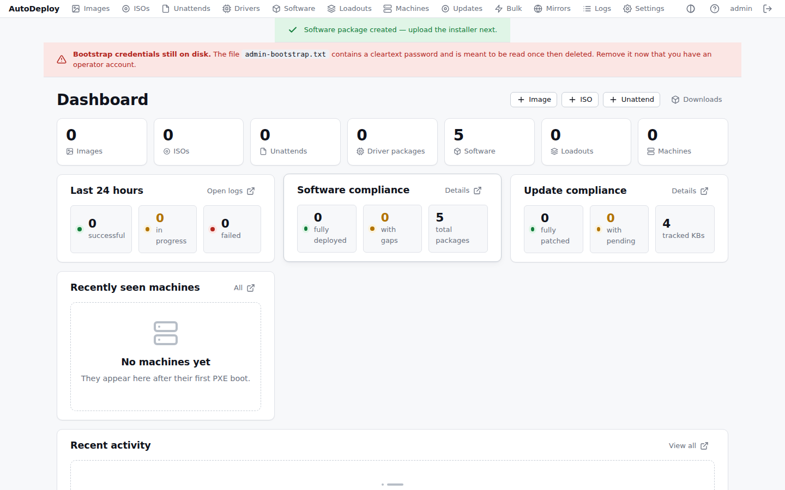
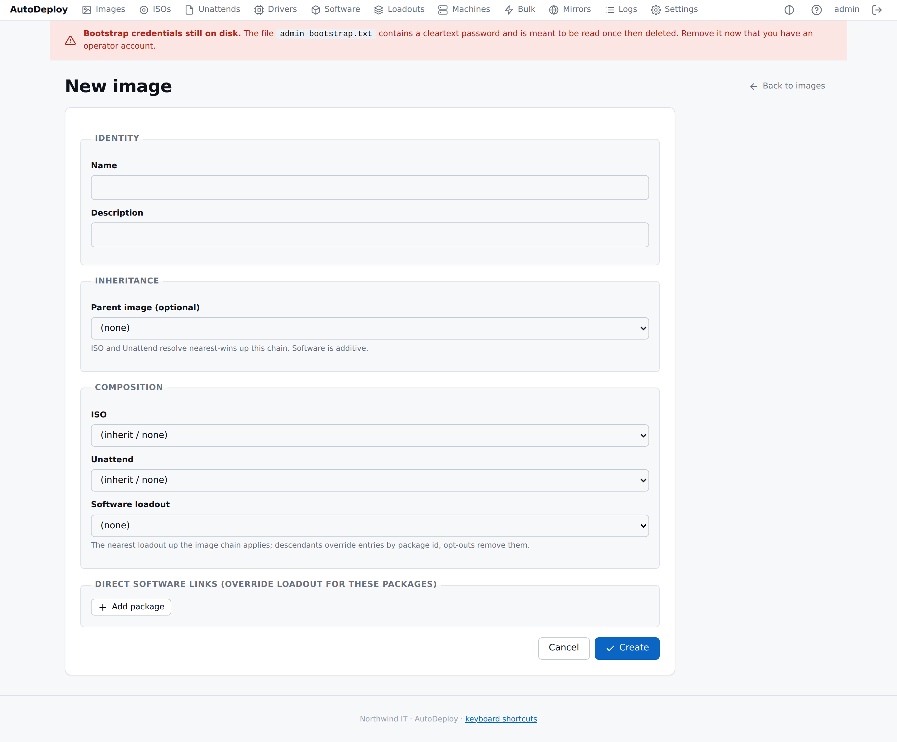
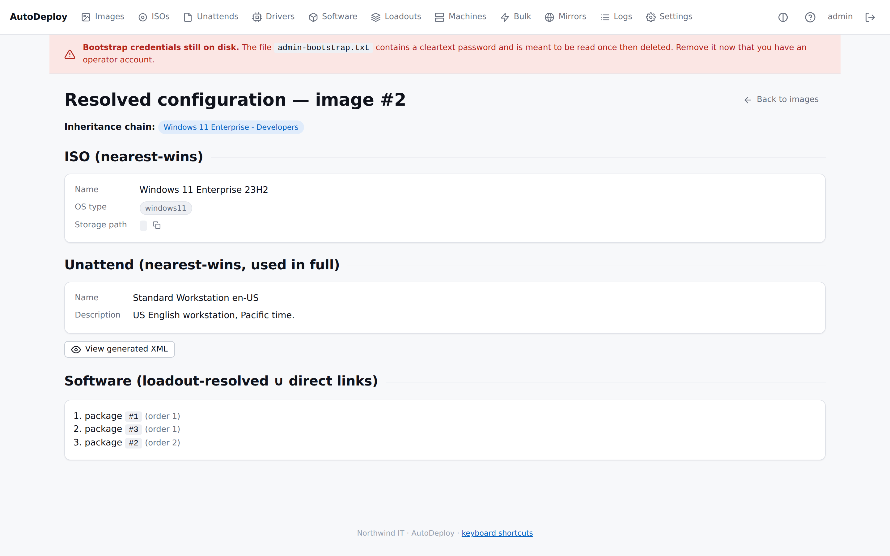

# Getting started

This walkthrough takes you from nothing to a deployed Windows machine. It assumes a Linux host for
the server and at least one target machine that can network-boot (a VM is fine).

You'll: install the server, set up network booting, upload Windows media, build an image, and
deploy it.

## 1. Install the server

Follow **[Installing the AutoDeploy server (Linux)](install/linux-server.md)**. In short:

```bash
TAG=$(curl -fsSL https://api.github.com/repos/Rusketh/AutoDeploy/releases/latest \
  | grep -oP '"tag_name":\s*"\K[^"]+')
BASE="https://github.com/Rusketh/AutoDeploy/releases/download/$TAG"
curl -fLO "$BASE/autodeploy-server-linux-amd64"
curl -fLO "$BASE/autodeploy-extras.tar.gz"
tar xzf autodeploy-extras.tar.gz
sudo ./scripts/install-linux.sh
sudo systemctl enable --now autodeploy
```

Then log in:

```bash
sudo cat /var/lib/autodeploy/admin-bootstrap.txt   # one-time admin password
```

Open `http://<your-server>:8080/portal/` (the default; enable HTTPS later if you want it), sign in
as `admin`, change the password in [Settings → Accounts](portal/settings.md#accounts), and delete
the bootstrap file. You'll land on the dashboard:



## 2. Set up network booting

Target machines need to PXE-boot into AutoDeploy. Configure your DHCP server to point PXE clients
at AutoDeploy's iPXE bootstrap, as described in **[PXE & boot setup](install/pxe-and-boot.md)**.
The installer already fetched the iPXE binaries and (with the default config) enabled the built-in
TFTP server on port 69.

## 3. Upload Windows media (ISO)

In the portal, go to **Payloads → ISOs**, click **New**, give it a name, and upload your Windows
ISO. AutoDeploy extracts it and prepares boot media; watch progress on the ISO's page. Details:
[Payloads → ISOs](portal/payloads.md#isos).

## 4. (Optional) Create an unattend file

An [unattend](portal/payloads.md#unattend-files) automates Windows Setup — locale, the local
admin account, OOBE, and domain join. Create one under **Payloads → Unattend files** if you want
hands-off installs. You can skip this for a first test.

## 5. Build an image

An [image](portal/images.md) ties everything together. Go to **Images → New** and select:

- the **ISO** from step 3,
- optionally an **unattend** from step 4,
- any **driver packages** and **software loadouts** you want applied.



Save it. Open the image's **Resolved** view to confirm AutoDeploy has assembled the expected media,
drivers and software:



## 6. Deploy

Network-boot your target machine. It loads the AutoDeploy boot client and contacts the server, so
it appears in **Machines**:


You have two ways to deploy:

- **From the boot menu** — select your image on the machine's screen, or
- **Bind ahead of time** — open the machine, [bind](portal/machines.md#bindings) it to your image,
  and it deploys on the next boot.

The boot client stages the Windows media and reboots into Setup. After Windows installs, the
[agent](introduction.md#agent-autodeploy-agent) runs automatically to install software and apply
configuration, then stays resident as a service.

## 7. Watch it happen

Track progress on the machine's detail page — hardware, current deployment, and history:


Every action is recorded in the [audit log](portal/logs.md).

## Next steps

- Add **[software packages](portal/software.md)** and group them into **[loadouts](portal/software.md#loadouts)**.
- Match **[drivers to hardware](portal/payloads.md#driver-packages)** automatically.
- Manage many machines at once with **[bulk operations](portal/bulk-operations.md)**.
- Set up **[Active Directory](operations/active-directory.md)** domain join.
- Scale out with **[mirrors](portal/mirrors.md)**.
</content>
