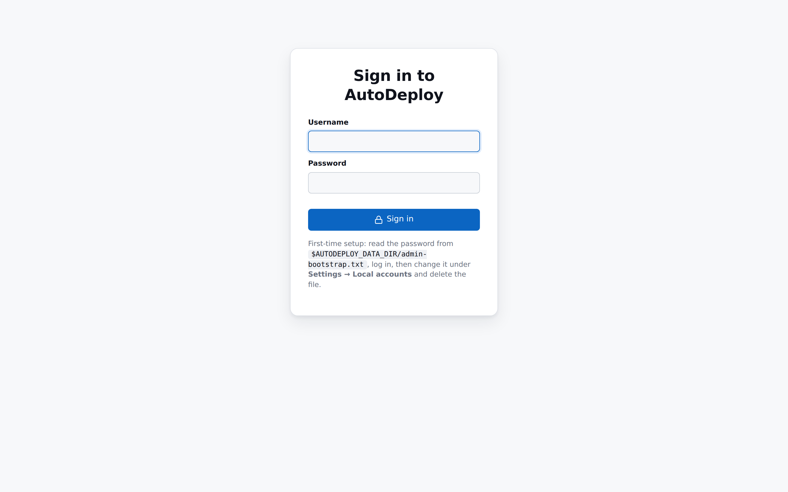

# Bulk operations

Bulk operations let you act on many machines at once: rename a batch, push an app to a department,
run a script across a lab, or re-image a fleet. You search for machines, build a selection, choose
an action, and queue it. Agents pull their job at the next check-in (re-image happens on the next
network boot).

The list shows past operations with their **action**, the **target** filter used, who **created**
it, and **when**. Click one to track it.

## Running an operation

Click **New bulk operation** and work through the steps.

### 1. Find machines

Search by **name regex**, **OU** (distinguished name), and/or **AD group**, then click **Search**.
The filter is a search tool only — the action runs on the *selection* you build, not on whatever
currently matches.

### 2. Build the selection

From the search results, **Add** the machines you want (or **Add all results**). The selection
panel shows what's queued and lets you remove entries. The action applies to exactly this set.

### 3. Choose an action

Pick the action type; the form reveals only the fields it needs:

| Action | What it does | Extra input |
|--------|--------------|-------------|
| Rename machine | Find/replace (regex) on each machine's current name | **Find** (regex) + **Replace** |
| Run a script | Run a PowerShell or cmd script on each machine | **Shell** + **Body** |
| Push software | Install a package (and its dependencies) on each machine | **Software package** |
| Re-image | Rebuild each machine from an image | **Image** (optional — defaults to each machine's bound image) |

Click **Queue operation** to start it.

## Tracking results

Open an operation from the list to see its **summary** (action, target, creator, payload) and its
**jobs** — one per targeted machine, each with a **status** (running / ok / failed), when it was
claimed and completed, and a result. Results fill in as agents pick up and report their jobs.

## Notes

- **Rename** does a regex find/replace across names (for example find `^LAB-A-`, replace `LAB-B-`).
  To rename a single machine to a literal name, use the action on that machine's
  [detail page](machines.md#run-an-action-on-this-machine) instead.
- **Re-image** is destructive: each machine reboots on its next check-in, network-boots into
  AutoDeploy, and re-images without operator interaction, so the machines must be configured to
  network-boot.
- Renames coordinate with Active Directory server-side before the local job is queued.
- Every bulk operation, and every script run, is recorded in the [activity log](logs.md).
