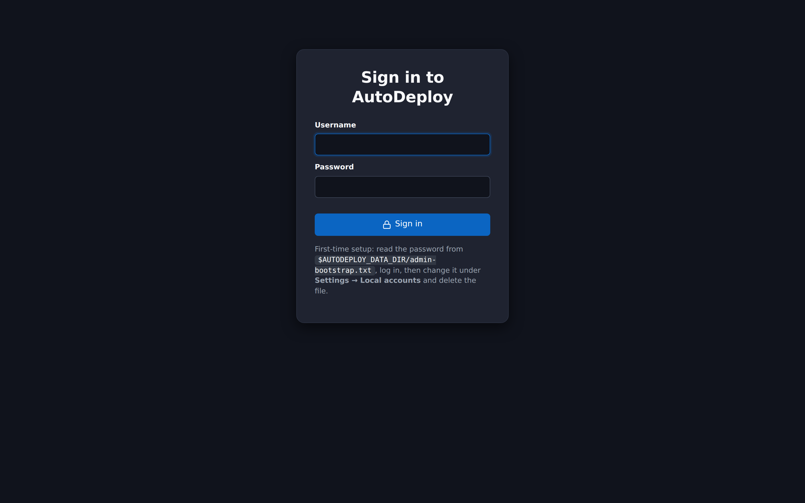

# Dashboard

The dashboard is where you land after signing in. It gives you an at-a-glance view of what's
configured and what's happening across your fleet, plus shortcuts to the things you do most often.

## Quick actions

Buttons in the top bar jump into common tasks: new **Image**, new **ISO**, new **Unattend**, and
the **Downloads** page.

## Counters

A row of counters shows how many of each building block you have — **Images**, **ISOs**,
**Unattends**, **Driver packages**, **Software**, **Loadouts**, and **Machines**. Each one links to
its list page, so it doubles as navigation.

## Last 24 hours

A rollup of deployment outcomes over the last 24 hours: **successful**, **in progress**, and
**failed**. It's a quick health check — a rising "failed" count is your cue to open the affected
machines or the [activity log](logs.md).

## Recently seen machines

The machines that have most recently network-booted or had their agent check in, with their
product, manufacturer, serial, and when they were last seen. Click one to open its
[detail page](machines.md).

## Recent activity

The newest entries from the [audit log](logs.md) — each with its time, level, component, action,
and target. For the full, searchable history, open **Logs**.

## Quick start

A short checklist links you through the first-run flow: upload an ISO, create an unattend, add
driver packages, define software, group them into loadouts, compose an image, then PXE-boot and
bind a machine.

## Light and dark theme

The portal supports both a light and a dark theme. Use the theme toggle in the top navigation bar
to switch (it cycles auto / light / dark); the portal remembers your choice.

