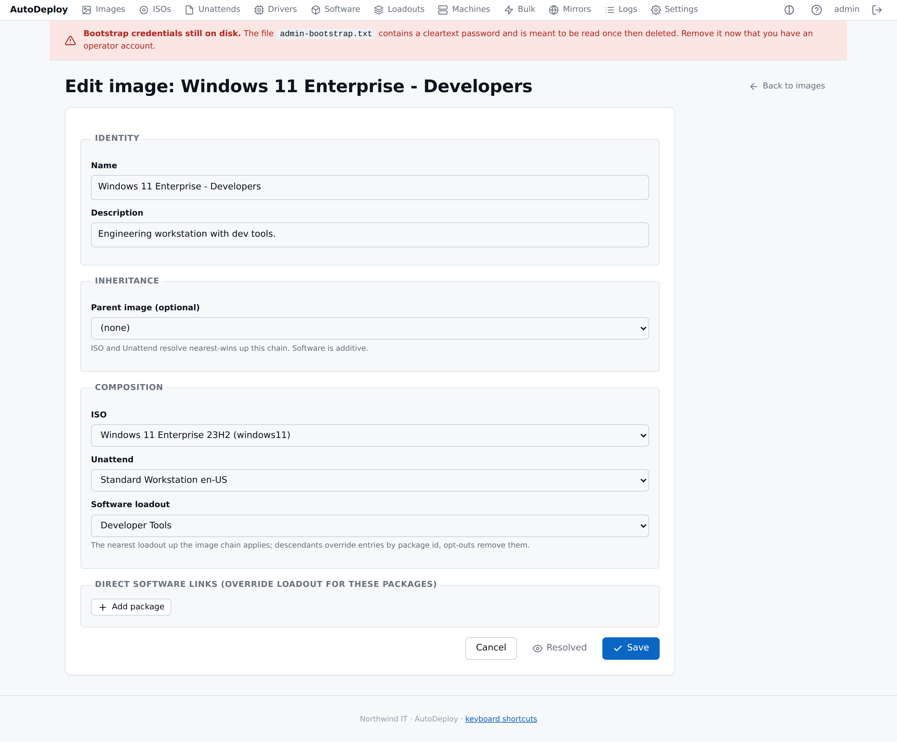

# Images

An **image** is the deployable recipe. It ties together the [payloads](payloads.md) and
[software](software.md) you've prepared into one thing you can deploy: an ISO, optionally an
unattend answer file, a software loadout, driver packages, and any direct software links — with
optional inheritance from a parent image.

When a machine deploys an image, AutoDeploy **resolves** it — works out the exact media, the
drivers that match that machine's hardware, and the flattened software list — and stages the
result.

The list shows each image's **name**, its **parent**, **ISO**, **unattend**, **loadout**, and a
**Direct sw** count of individually linked software packages.

## Composing an image

Go to **Images → New** and assemble the recipe.

| Section | What you pick |
|---------|---------------|
| Identity | Name (required) and description |
| Inheritance | An optional **parent image** — ISO and unattend resolve nearest-wins up the chain; software is additive |
| ISO | The Windows media (or inherit from the parent) |
| Unattend | The answer file (or inherit from the parent) |
| Software loadout | A single [loadout](software.md#loadouts) to install |
| Direct software links | Individual [software packages](software.md) to install, each with an order — these override the loadout for those packages |
| Active Directory domain join | Optionally have the agent join machines from this image to AD — see [below](#active-directory-domain-join) |
| Setup lockout screen | Optionally show a branded full-screen setup screen that blocks sign-in until the first software install finishes — see [below](#setup-lockout-screen) |

Save the image. You can edit it later to change any of these selections.

## Active Directory domain join

The image editor has an **Active Directory domain join (via agent)** section. When enabled, the
[agent](../operations/active-directory.md#agent-driven-join-recommended) joins machines deployed
from this image to the domain **after first boot** — when networking and DNS are fully up, which is
much more reliable than joining during Windows Setup.

| Field | Notes |
|-------|-------|
| Enable | Turn on agent-driven join for this image |
| Domain (FQDN) | e.g. `corp.example.com` |
| Computer object OU | Optional DN; a machine's [binding](machines.md#bindings) Target OU overrides it per machine |
| Join account | A least-privilege account that can join computers |
| Join account password | Stored encrypted; handed only to the deploying agent, **never written into the unattend XML**. Leave blank when editing to keep the current password. |

> When agent-driven join is enabled, any domain-join settings in the image's **unattend are
> ignored** — AutoDeploy drops the unattend join block so Setup doesn't also attempt an online
> join. See [Active Directory](../operations/active-directory.md#domain-join-during-deployment).

## Setup lockout screen

The image editor has a **Setup lockout screen** toggle. When enabled, machines deployed from this
image show a **branded full-screen setup screen in place of the Windows logon screen** on every
display while the agent runs the image's first-boot software install. It shows a progress bar and
the current activity (for example "Installing Microsoft Office"), and normal sign-in is blocked
until the machine is ready for first use.

- The lock applies to the **initial deployment only** — later [software pushes](bulk-operations.md)
  never lock an already-provisioned machine.
- A technician can dismiss the screen early with the global [Access PIN](settings.md#access-pin)
  (press **Ctrl+Alt+U**).
- The screen uses your [branding](settings.md#branding) — product name, organisation, colour and
  logo.
- It's delivered automatically by the agent's bundled credential provider; there is nothing to
  install by hand.

> Drivers are not attached to the image directly — at deploy time AutoDeploy evaluates every
> [driver package's SMBIOS filters](payloads.md#driver-packages) against the target machine and
> stages the ones that match.

> An image deploys usable media only when its resolved ISO's **boot media** is ready — see
> [Payloads → ISOs](payloads.md#isos).

## The Resolved view

Composing an image lists *what you selected*. The **Resolved** view
(`/portal/images/{id}/resolved`) shows *what a deployment will actually apply* once inheritance is
worked out. Use it to sanity-check an image before you deploy.

It shows:

- **Inheritance chain** — the images resolution walks, parent to child.
- **ISO** (nearest-wins up the chain) — name, OS type, and storage path.
- **Unattend** (nearest-wins, used in full) — with a link to view the generated XML.
- **Software** — the de-duplicated list resolved from the loadout (following parent inheritance and
  opt-outs) combined with the image's direct links, in install order.
- **Warnings** — any diagnostics from resolution.

## Deploying an image

There are two ways to get an image onto a machine:

- **From the boot menu** — when a machine network-boots, the operator selects the image on its
  screen.
- **Bind it ahead of time** — open the machine and [bind](machines.md#bindings) it to the image;
  it deploys automatically on the next network boot. You can also re-image many machines at once
  with a [bulk operation](bulk-operations.md).

## Next steps

- Set up [network booting](../install/pxe-and-boot.md) so machines can deploy.
- Watch deployments and manage machines in [Machines](machines.md).
