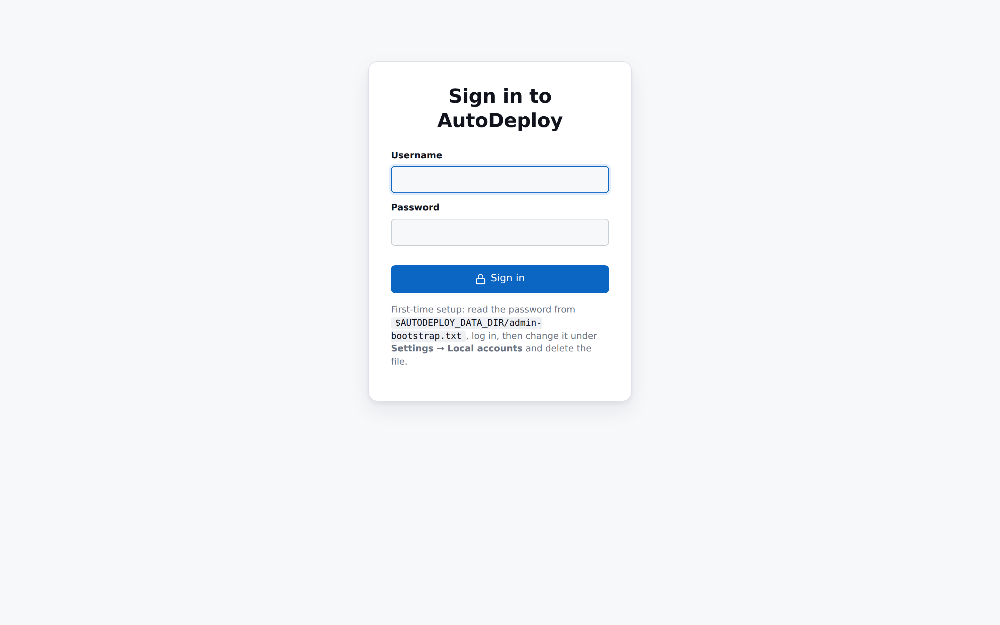

# Activity log

The **Logs** page is AutoDeploy's audit trail: every operator and client action, newest first. Use
it to answer "what happened, when, and who did it" — from an operator editing an image to a Boot
Client staging media on a machine.

## What gets logged

The log captures events from across the system, including:

- **Operator actions** in the portal and API — creating and editing payloads, composing images,
  binding machines, running [bulk operations](bulk-operations.md), changing settings, and so on.
- **Client actions** — the [Boot Client](../introduction.md#boot-client-autodeploy-boot) and
  [agent](../introduction.md#agent-autodeploy-agent) report what they do (identifying, staging
  media, deploying, installing software, reporting results), and those events ship back to the
  server's log.

Each entry records its **time**, **level**, **component** (server / boot / agent), **actor**,
**action**, **target**, and a **fields** detail blob.

> Secrets are never logged. Retrieving a stored secret (such as a domain-join password) emits a
> `secret.access` event recording the actor and target — but never the value.

## Live tail

A **Live tail** panel streams the newest events in every few seconds, so you can watch a deployment
unfold without refreshing. Toggle it from the button in the top bar.

## Searching and filtering

The **Search** form filters by **component**, **actor**, **action**, a **since** time, and a result
**limit**. Within the returned rows there's also a quick row-filter box. Results are newest-first.

## Retention

How long entries are kept is controlled by the log retention setting in
[Settings → Operational](settings.md#operational). A scheduler prunes rows older than the cutoff;
setting retention to 0 disables pruning.

## Related

- A condensed feed of the most recent entries also appears on the [dashboard](dashboard.md).
