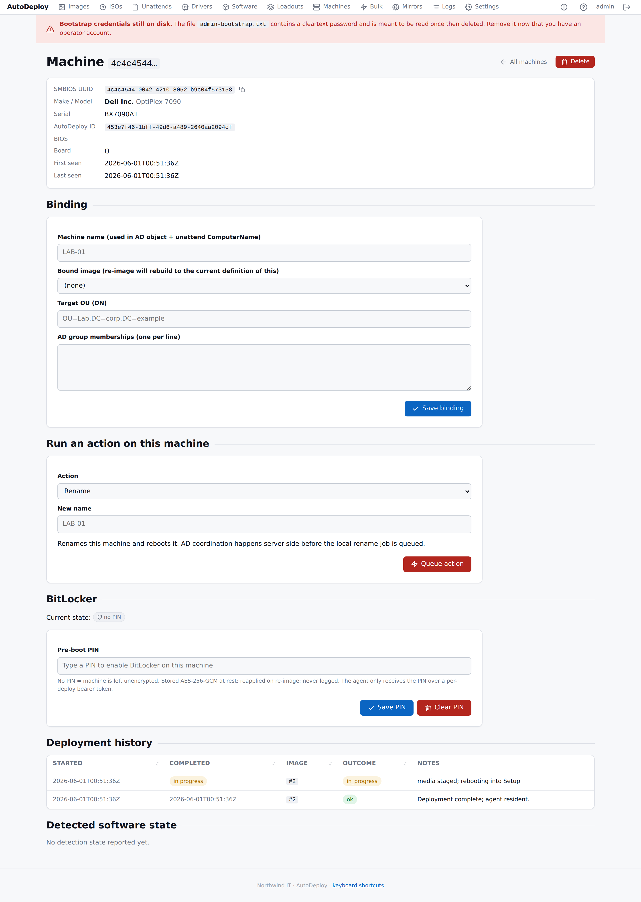

# Machines

The **Machines** page is your inventory: every machine that has network-booted into AutoDeploy or
whose [agent](../introduction.md#agent-autodeploy-agent) has checked in. You don't add machines by
hand — they appear automatically, keyed by their SMBIOS UUID.

## The inventory list

The list shows, per machine:

| Column | Notes |
|--------|-------|
| UUID | The SMBIOS UUID (truncated; click to open, or copy the full value) |
| Name | The machine's current computer name (agent-reported, or desired name from binding) |
| Make / model | Manufacturer and product, from SMBIOS |
| Serial | System serial |
| OS | The running OS (e.g. "Microsoft Windows 10 Pro"), from the agent's hardware report |
| Image | The bound image's name |
| BitLocker | Whether a pre-boot PIN is configured |
| Last seen | When the machine last contacted the server |

Use the **filter** box to narrow the list. You can also select machines with the checkboxes and
**delete** them in bulk.

### Exporting to CSV

Click **Export CSV** to download the inventory as `machines.csv` for reporting or to feed into
other tools.

## Machine detail

Click a machine to open its detail page, which gathers everything known about it.

At the top, **summary cards** give a quick overview:

- **Software detected** — how many of the machine's targeted packages are detected vs total
- **KBs installed** — how many tracked Windows Updates are installed on this machine
- **OS** — the running OS caption and version
- **Last seen** — when the machine last contacted the server

Below the summary cards, the header shows its SMBIOS UUID, make/model, serial, AutoDeploy ID,
BIOS, baseboard, and first/last-seen times.

### Hardware

Reported by the Boot Client and agent at check-in: **CPU** (with core/thread counts), **memory**,
**disks** (model and size), **GPU**, **network** interfaces (name, MAC, IPs), and the running **OS**
once the agent is up.

### Bindings

A **binding** links a machine to the [image](images.md) it should receive, plus per-machine
identity. In the **Binding** panel you can set:

- **Machine name** — used as the AD object name and the unattend's ComputerName.
- **Bound image** — re-imaging rebuilds the machine to the current definition of this image.
- **Target OU** — the AD organizational unit (distinguished name).
- **AD group memberships** — one per line.

Save it, and the bound image deploys automatically the next time the machine network-boots. Binding
ahead of time is the hands-off path: bind a machine (or a whole set, via a
[bulk re-image](bulk-operations.md)), then boot it and walk away.

### Bulk edit

**Bulk edit** (button on the machine list) applies one binding change to many machines at once:
search by name regex, OU, or AD group, add the machines to a selection, then tick the fields to
change — bound **image** (set or clear), **machine name template**, **target OU**, and **group
memberships** (comma-separated adds and removals that merge with each machine's existing list).
Unticked fields are left exactly as they are on each machine.

Because the same name would collide across machines, the name field takes a *template* —
`LAB-%serial(6)%`, `%random(8)%`, etc. — expanded per machine at deploy/rename time. Like the
single-machine panel, bulk edits change **intended** state: a new OU or name takes effect at the
machine's next deploy, domain join, or rename rather than moving anything immediately. Every bulk
edit is recorded in the [audit log](logs.md).

### Run an action on this machine

The **Run an action** panel queues a single action for this machine (the agent picks it up at its
next check-in, typically within a few minutes):

- **Rename** — rename and reboot.
- **Run a script** — a PowerShell or cmd script.
- **Push software** — install a package (and its dependencies; detection rules skip what's already
  present).
- **Re-image** — rebuild from an image (this machine's bound image, or one you choose). Destructive;
  the machine network-boots and re-images on its next check-in.

The same actions across many machines at once are [bulk operations](bulk-operations.md).

### BitLocker

The **BitLocker** panel manages a pre-boot **PIN** for the machine. Set a PIN to enable BitLocker
on the next deploy; leave it empty to leave the volume unencrypted. The PIN is stored encrypted at
rest, reapplied on re-image, and never logged.

When recovery keys have been escrowed, a **recovery-key history** table lists each escrow with its
time and note, and a link to retrieve the key (retrieval is itself audited — it records who and
when, never the value). For the full workflow, see the
[BitLocker operations guide](../operations/bitlocker.md).

### History and detected software

Further down, the page lists the machine's **deployment history** (start/finish, image, outcome,
notes), its **detected software state** (which packages the agent has found present or absent,
and when last evaluated), and its **Windows Update status** (a table of tracked KBs with their
install status — installed, pending, or failed — and when last reported).

### Removing a machine

The **Delete** action removes a record from inventory (binding, history, and detection state). A
machine that network-boots again simply re-appears.

## Next steps

- Act on many machines at once with [bulk operations](bulk-operations.md).
- Review who did what in the [activity log](logs.md).
