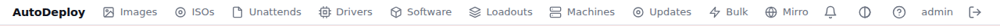
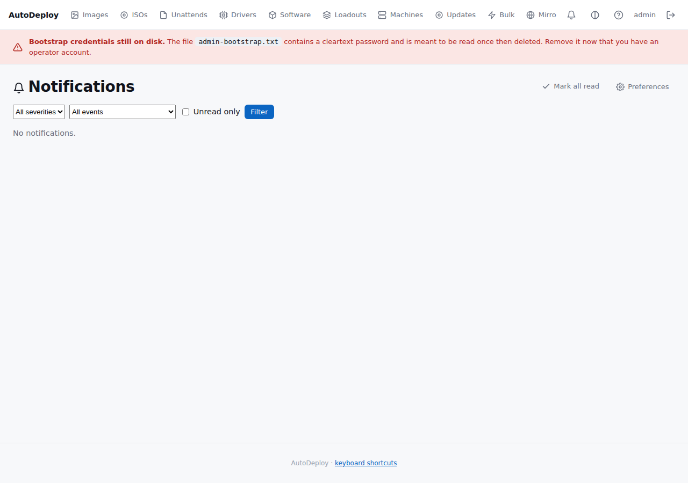
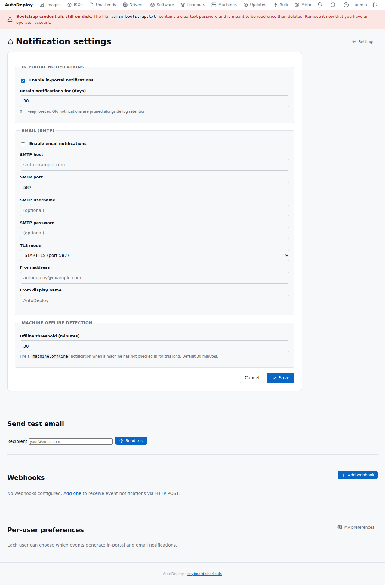
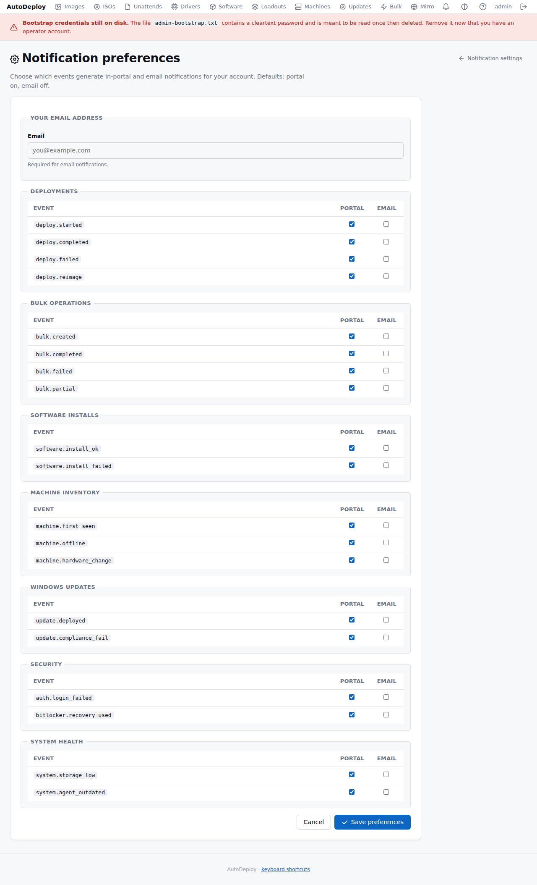
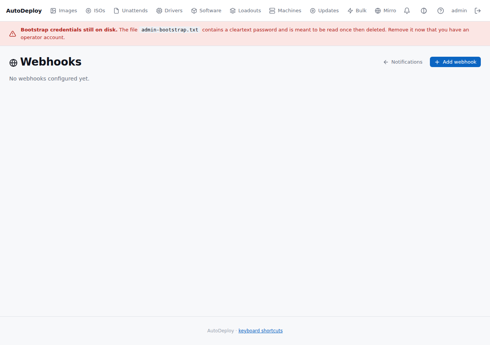
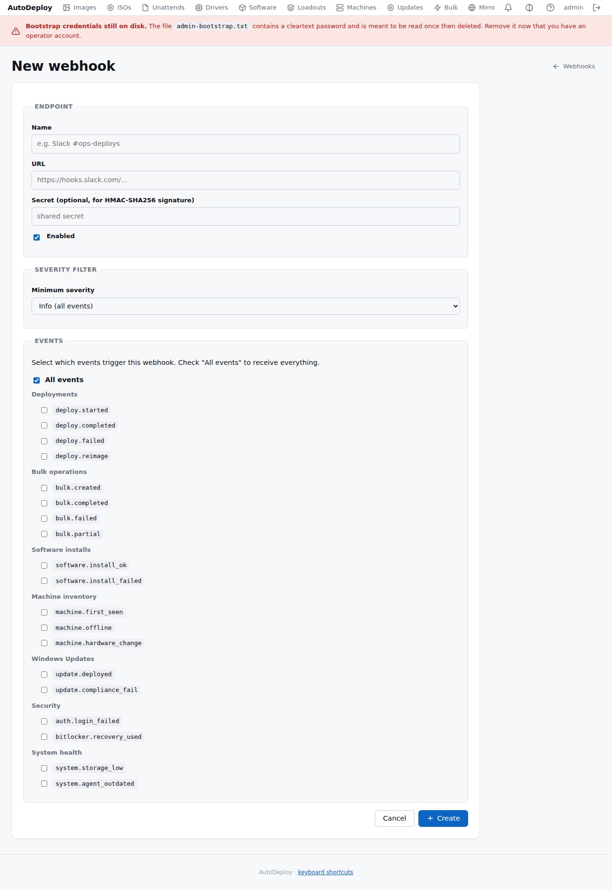

# Notifications

AutoDeploy's notification system delivers event alerts through three channels — **in-portal**,
**email**, and **webhooks** — so operators stay informed without watching the dashboard. Configure
which events fire, who receives them, and through which channels from
**Settings > Notifications**.

## Channels

### In-portal notifications

A **bell icon** in the portal header shows a red badge with the unread count. Click it to open the
[notification center](#notification-center). The badge polls every 30 seconds.



### Email

Email notifications are delivered via SMTP when enabled. Each email includes the event title,
severity-coloured styling, a body paragraph, and a **View in Portal** button linking to the
relevant page. Subjects are prefixed with the severity level for quick scanning
(e.g. `[ERROR] Deploy failed on LAB-PC-012`).

### Webhooks

Webhook endpoints receive a JSON `POST` for each matching event. Payloads include the event name,
severity, title, body, link, actor, and any extra fields. An `X-AutoDeploy-Signature` header
carries an HMAC-SHA256 signature (computed with the shared secret) so receivers can verify
authenticity. Deliveries retry up to 3 times with exponential backoff (5 s, 30 s) and all
attempts are logged for debugging.

## Event types

Events are grouped into seven categories:

| Category | Events |
|----------|--------|
| **Deployments** | `deploy.started`, `deploy.completed`, `deploy.failed`, `deploy.reimage` |
| **Bulk operations** | `bulk.created`, `bulk.completed`, `bulk.failed`, `bulk.partial` |
| **Software installs** | `software.install_ok`, `software.install_failed` |
| **Machine inventory** | `machine.first_seen`, `machine.offline`, `machine.hardware_change` |
| **Windows Updates** | `update.deployed`, `update.compliance_fail` |
| **Security** | `auth.login_failed` |
| **System health** | `system.storage_low`, `system.agent_outdated` |

Each event has a severity: **info**, **success**, **warning**, or **error**.

Notes on when events fire:

- `deploy.started` fires for a first-time install; a rebuild of an existing machine fires
  `deploy.reimage` instead (severity **warning**, since it wipes the machine).
- `machine.offline` fires **once per offline episode**: when the machine next checks in, the
  episode closes and a later disappearance notifies again.
- `bulk.partial` covers runs that mixed successes with failures *or* jobs cancelled by the
  operation's cancel-after window.
- `machine.hardware_change`, `update.compliance_fail`, `system.storage_low` and
  `system.agent_outdated` are reserved: they appear in the preference/webhook pickers but are not
  emitted yet.

## Notification center

The **Notifications** page (`/portal/notifications`) lists all in-portal notifications for the
current user, newest first.



Features:

- **Filter bar** — filter by severity, event type, or unread-only
- **Mark all read** — clears the unread badge in one click
- **Pagination** — numbered page links with an items-per-page selector; page links keep the
  active filters
- **Click-through links** — each notification links to the relevant portal page (machine detail,
  bulk operation, etc.)

## Settings

### Global settings

Navigate to **Settings > Notifications** to configure the system-wide notification behaviour.



#### In-portal

| Field | Notes |
|-------|-------|
| Enable in-portal notifications | Master toggle (default: on) |
| Retain notifications for (days) | `0` = keep forever; old rows are pruned alongside log retention |

#### Email (SMTP)

| Field | Notes |
|-------|-------|
| Enable email notifications | Master toggle (default: off) |
| SMTP host | e.g. `smtp.example.com` |
| SMTP port | 25, 465, or 587 |
| SMTP username / password | Optional; password is encrypted at rest (AES-256-GCM) |
| TLS mode | STARTTLS (587), Implicit TLS (465), or None (25) |
| From address | e.g. `autodeploy@example.com` |
| From display name | e.g. `AutoDeploy` (defaults to the product name from branding) |

Use the **Send test** button to verify the SMTP configuration. Enter a recipient address or use
your account's email.

#### Machine offline detection

| Field | Notes |
|-------|-------|
| Offline threshold (minutes) | Fire a `machine.offline` event when a machine hasn't checked in for this long (default: 30) |

### Per-user preferences

Each user can choose which events generate in-portal and email notifications from
**Settings > Notifications > My preferences**.



The page shows a table of event categories with checkbox columns for **Portal** and **Email**.
Defaults: portal on, email off for all events. Set your email address here to receive email
notifications.

## Webhooks

### Managing webhooks

Navigate to **Settings > Notifications > Webhooks** to see all configured endpoints.



### Creating a webhook

Click **Add webhook** to configure a new endpoint.



| Field | Notes |
|-------|-------|
| Name | Human label (e.g. "Slack #ops-deploys") |
| URL | HTTPS endpoint that receives the POST |
| Secret | Optional shared secret for HMAC-SHA256 signature verification; encrypted at rest |
| Enabled | On/off toggle |
| Minimum severity | Only fire for events at this severity or higher |
| Events | Check specific events, or "All events" for everything |

### Webhook payload

```json
{
  "event": "deploy.failed",
  "severity": "error",
  "occurred_at": "2026-06-04T14:32:00Z",
  "title": "Deploy failed on LAB-PC-012",
  "body": "Windows 11 24H2 image failed during WIM apply phase.",
  "link": "https://autodeploy.local/portal/machines/123",
  "actor": "system",
  "fields": { "image": "Win11-Lab", "error": "disk full" }
}
```

The request includes these headers:

| Header | Value |
|--------|-------|
| `Content-Type` | `application/json` |
| `User-Agent` | `AutoDeploy-Webhook/1.0` |
| `X-AutoDeploy-Signature` | `sha256=<HMAC hex>` (only when a secret is set) |

### Delivery log

Each webhook has a **Deliveries** page showing recent delivery attempts with:

- Timestamp, event name, HTTP status code, duration, and any error message
- Green/red status indicators for quick scanning
- Full payload available for debugging

### Testing

Use the **Send test** button on the webhook edit page to deliver a sample `system.test` event.
Check the delivery log to verify the endpoint received it correctly.

## API

All notification features are also available through the REST API:

| Method | Path | Description |
|--------|------|-------------|
| `GET` | `/api/v1/notifications` | List current user's notifications |
| `GET` | `/api/v1/notifications/unread-count` | Badge count (`{"count": N}`) |
| `POST` | `/api/v1/notifications/mark-read` | Mark specific IDs as read |
| `POST` | `/api/v1/notifications/mark-all-read` | Mark all as read |
| `GET` | `/api/v1/notifications/preferences` | Current user's preferences |
| `PUT` | `/api/v1/notifications/preferences` | Update preferences |
| `GET` | `/api/v1/notifications/events` | List all event types and categories |
| `GET` | `/api/v1/webhooks` | List webhooks |
| `POST` | `/api/v1/webhooks` | Create webhook |
| `GET` | `/api/v1/webhooks/{id}` | Get webhook |
| `PUT` | `/api/v1/webhooks/{id}` | Update webhook |
| `DELETE` | `/api/v1/webhooks/{id}` | Delete webhook |
| `POST` | `/api/v1/webhooks/{id}/test` | Send test event |
| `GET` | `/api/v1/webhooks/{id}/deliveries` | Delivery log |

## Retention

- **Notification rows** are pruned by the retention scheduler based on the configured retention
  period (default 30 days). Set to `0` to keep forever.
- **Webhook delivery logs** are pruned after 30 days automatically.
- Both run on the same hourly tick as [log retention](../operations/backup-and-retention.md).
