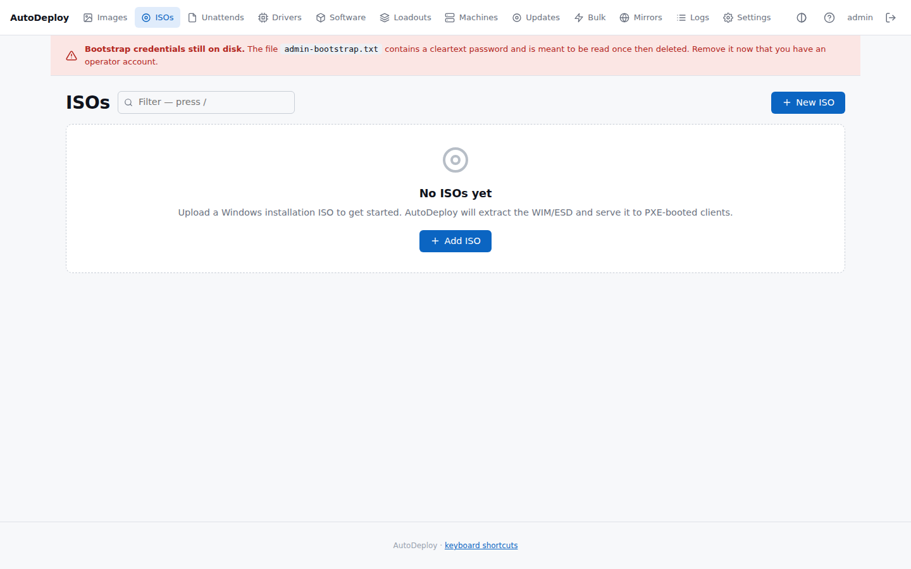
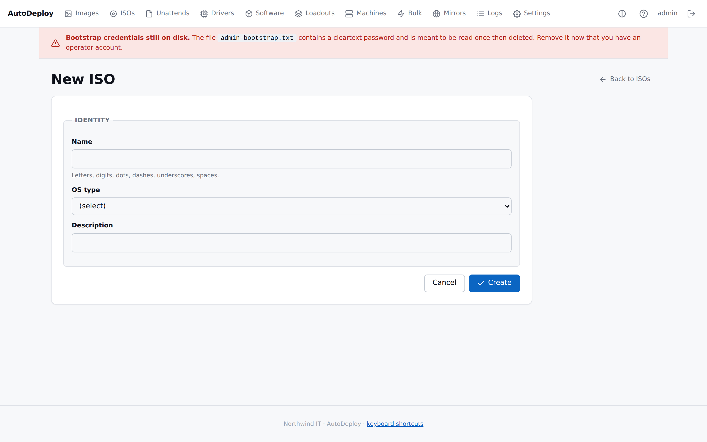
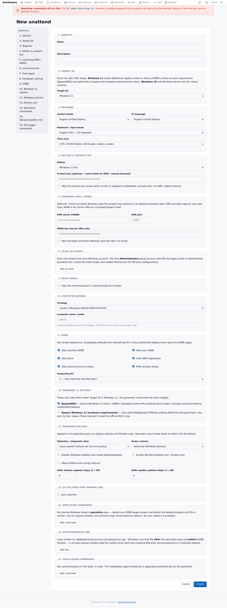
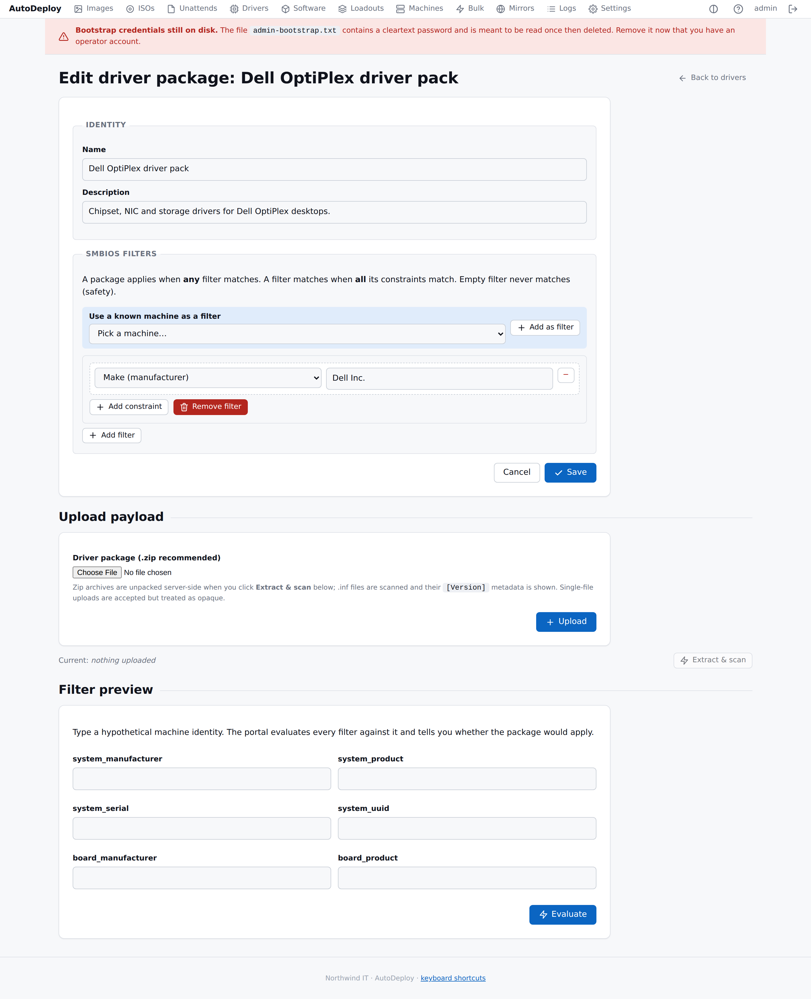

# Payloads: ISOs, unattend files & drivers

Payloads are the raw materials a deployment is built from. This page covers three of them:

- [**ISOs**](#isos) — your Windows installation media.
- [**Unattend files**](#unattend-files) — answer files that automate Windows Setup.
- [**Driver packages**](#driver-packages) — drivers matched to specific hardware.

You combine these (along with [software](software.md)) into an [image](images.md), which is what
actually gets deployed.

## ISOs

An ISO is an uploaded **Windows installation image**. You upload it once and reuse it across as
many images as you like. After upload, AutoDeploy extracts the media and prepares it for the
[Boot Client](../introduction.md#boot-client-autodeploy-boot) to stream onto target machines.

The list shows each ISO's **OS type**, its **boot media** state, **size**, **storage path**, and
how many images it is **used by**.

### Uploading an ISO

1. Go to **ISOs** in the top navigation and click **New ISO**.
2. Give it a **Name** (required), pick the **OS type** (Windows 10 / 11 / Server 2019 / 2022 /
   2025 — required), and optionally a **Description**. Save.
3. On the next screen, choose your Windows **ISO file** and click **Upload**.

The upload streams to disk (large ISOs are fine), then a background job extracts the media and
prepares boot media. The edit page shows a live progress bar while this runs.

### Boot-media preparation and status

Extraction and boot-media preparation are handled by the server — there's nothing more for you to
do. The ISO record tracks the result:

- **Boot media** state appears in the list and on the edit page as **ready** (ready to deploy),
  **not uploaded**, **not extracted**, **not bootable**, or **needs attention** (with the error on
  hover).
- The **Boot media** panel on the edit page breaks down what was prepared: the ingested media tree
  (file count and total size), the WinPE boot image (`sources/boot.wim`), the install image
  (`sources/install.*`), and the UEFI bootloader (`efi/boot/bootx64.efi`).

A Windows `install.wim` larger than 4 GiB is split into `.swm` parts so it fits the FAT32 boot
partition the Boot Client creates; the panel shows the split count when this happens. If a tool
needed for extraction or splitting is missing, the status shows the error.

You can edit an ISO's name, OS type, and description after upload, re-upload the file, or click
**Re-prepare media** to run extraction again.

## Unattend files

An unattend file is an **answer file** for Windows Setup. It captures the choices a person would
otherwise click through — locale, accounts, OOBE, licensing, policies, post-install commands, and
optionally joining an Active Directory domain — so installs run hands-off. One unattend can be
reused across many images.

### Creating an unattend

Go to **Unattends → New**. The form is organised into numbered sections (a sidebar jumps between
them). Only the **Name** is required; everything else has a sensible default. The main sections:

| Section | What it controls |
|---------|------------------|
| Identity | Name and description |
| Target OS | Windows 10 / 11 / Server — picks the right XML shape |
| Regional | System locale, UI language, keyboard, time zone |
| Edition & product key | Windows edition; optional product key |
| Licensing | KMS server/port or AVMA key (optional) |
| Local accounts | One or more local accounts (name, password, group, display name) |
| Auto-logon | Sign an account in automatically for N boots |
| Computer naming | Random, literal, or prefix + random suffix |
| OOBE | Skip the out-of-box-experience screens |
| Windows 11 options | BypassNRO and hardware-requirement bypass (Win 11 only) |
| Windows policies | Telemetry, Windows Update, RDP, firewall, power scheme |
| Domain join | Join an Active Directory domain |
| Specialize / SetupComplete / first-logon commands | Custom commands at each Setup stage |

The AutoDeploy agent's first-logon bootstrap is appended to the generated file automatically — you
don't add it yourself.

### Domain join

In the **Domain join** section, tick **Join a domain** and fill in the domain (FQDN), target OU
(distinguished name), and a join account (UPN or `DOMAIN\user`) with its password. When
server-side [Active Directory integration](settings.md#active-directory) is configured, AutoDeploy
prepares the computer object before the unattend runs — see the
[Active Directory operations guide](../operations/active-directory.md).

### Previewing the generated answer file

You don't write XML by hand. AutoDeploy generates the `autounattend.xml` from your settings, and
you can review the exact file it will produce from an unattend's **Preview** page
(`/portal/unattends/{id}/preview`), which also offers a copy button. Per-machine identity (computer
name, target OU) is layered on at deploy time; the preview shows the catalog values.

## Driver packages

A driver package is a bundle of **drivers** with optional **SMBIOS filters**. At deployment time,
AutoDeploy looks at the target machine's hardware identity and applies the driver packages whose
filters fit — so a laptop gets laptop drivers and a desktop gets desktop drivers, from the same
image.

### Creating a driver package

Go to **Drivers → New**, give it a **Name** (required) and optional **Description**, define the
SMBIOS filters, save, then upload the driver archive (a `.zip` is recommended). After uploading,
click **Extract & scan** to unpack the zip and list the discovered `.inf` files with their class,
provider, and version.

### SMBIOS filters

A package can have several **filters**. The matching rule is:

- A package **applies when any one filter matches**.
- A filter **matches when all of its keys match**.
- A key **matches when the reported value equals any one of its listed values**. List the same
  field more than once in a filter to cover several models that share one driver package — e.g. a
  filter with `system_manufacturer = Dell Inc.` plus three `system_product` rows (`Latitude 5520`,
  `Latitude 5530`, `Latitude 5540`) matches any of those three models.
- An **empty filter never matches** (a safety default — a package with no filters won't be applied
  to anything).

Each constraint is a key/value pair. Keys come from the machine's SMBIOS data — for example
`system_manufacturer`, `system_product`, `system_serial`, `system_uuid`, `board_manufacturer`,
`board_product`. A value of `*` matches any non-empty value for that key. There's also a helper to
**use a known machine as a filter**, which seeds a filter from an inventory machine's manufacturer
and product so you can start from a real device.

### Testing and how matching applies

The edit page has a **Filter preview**: type a hypothetical machine identity and AutoDeploy
evaluates every filter against it, telling you whether the package would apply and which filters
matched.

At deploy time, the Boot Client sends the real machine's SMBIOS identity when it requests the
[image](images.md) manifest. The server evaluates each attached driver package's filters and stages
only the matching packages' drivers onto the boot media, where Windows Setup picks them up.

## Next steps

- Add [software packages and loadouts](software.md).
- Combine these payloads into an [image](images.md).
