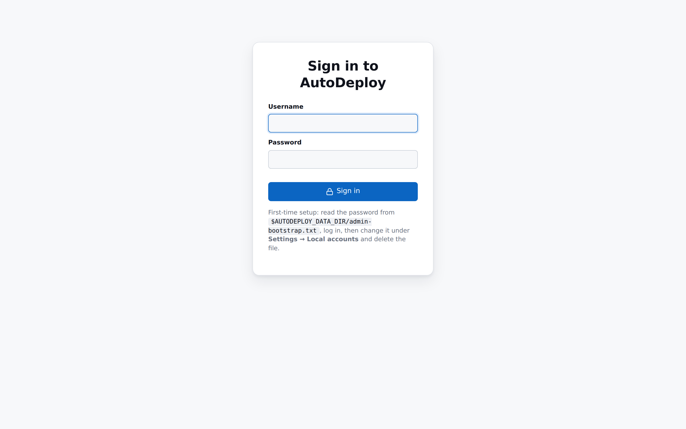
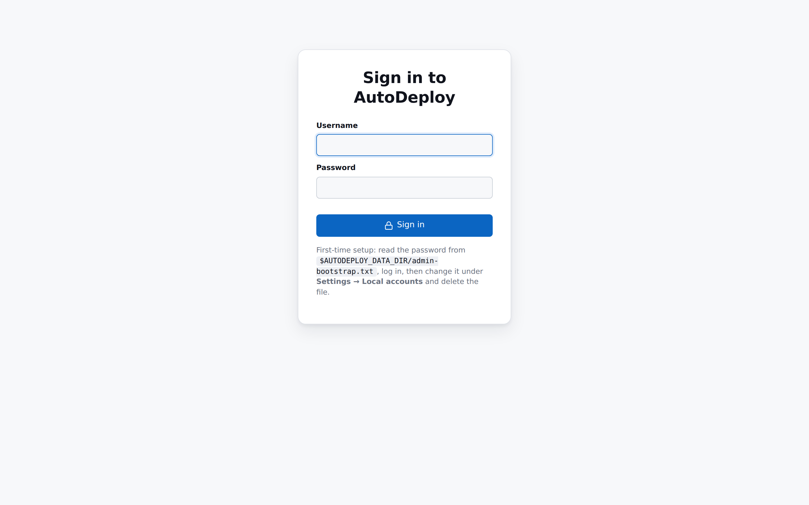
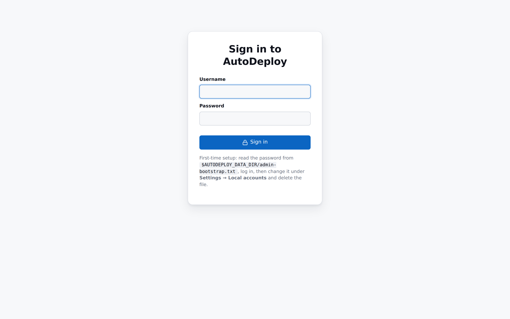

# Settings

The **Settings** area is a hub of small pages, each editing one slice of server configuration.
Operator-changeable configuration lives here; low-level bootstrap settings (bind addresses, data
directory, the at-rest secrets key) stay in environment variables on the server. This page
documents each area:

- [Accounts](#accounts)
- [Access PIN](#access-pin)
- [Branding](#branding)
- [Active Directory](#active-directory)
- [Operational](#operational)
- [Storage](#storage)
- [Updates](#updates)
- [PXE](#pxe)

## Accounts

Local logins for the portal and API. There is no graded permission model — every active account has
full access; accountability rests on the [audit log](logs.md).

The table lists each account with its **status** (active or disabled) and creation time. For each
account you can **set a new password**, **disable** or **enable** it, or **delete** it (you can't
delete your own account). There's a dedicated field to change your own password, and an **Add
account** form that takes a **username** and **password** (both required).

> The first account (`admin`) is created automatically on first start, with a one-time password
> written to a bootstrap file. Change it here and delete the bootstrap file — see
> [Installing the server](../install/linux-server.md#step-6--first-login).

## Access PIN

An optional **PIN** that gates the PXE boot menu, so only people who know it can start a deployment
from a booting machine.

Type a PIN and **Save** to require it; the Boot Client prompts for it before showing the menu.
Leave the field **empty** to remove the PIN. The PIN is hashed at rest and rate-limited per machine
(repeated failures are locked out).

> Server-initiated re-images (for example, a [bulk re-image](bulk-operations.md)) are already
> authorised by an operator and don't prompt for the PIN at the machine.

## Branding

Customise the names, colour, and support details shown in the portal and on the boot menu, plus the
OEM info written to deployed machines.

| Field | Notes |
|-------|-------|
| Product name | Shown in the portal header and the boot menu (required) |
| Organisation name | Shown alongside the product name |
| Support URL / Support phone | Contact details |
| OEM Manufacturer | Written to the deployed machine's OEM information by the agent (defaults to the organisation name) |
| Primary colour | Accent colour for buttons, badges, and the active nav highlight |
| Logo | A data URL, or upload an image to embed it |

## Active Directory

LDAP connection details so AutoDeploy can manage computer objects for
[unattend files](payloads.md#unattend-files) that join a domain.

| Field | Example |
|-------|---------|
| LDAP URL | `ldaps://dc.corp.example:636` |
| Service-account bind DN | `CN=autodeploy,OU=Service Accounts,DC=corp,DC=example` |
| Service-account password | Stored encrypted at rest; never logged |
| Search base | `DC=corp,DC=example` |
| Skip TLS verification | Lab DCs with self-signed certs only |

A **Test connection** button validates the settings, and there's a **Disable AD** action. Changes
take effect on the next manifest request — no restart needed. For the full setup and workflow, see
the [Active Directory operations guide](../operations/active-directory.md).

## Operational

Log retention and payload concurrency.

| Field | Notes |
|-------|-------|
| Log retention (days) | How long [activity log](logs.md) entries are kept; `0` disables pruning |
| Maximum concurrent `/payload/*` streams | Caps simultaneous payload downloads so a rush queues instead of thrashing the server; `0` = unlimited. Takes effect on next restart |

## Storage

Where each category of payload is stored on disk. The relative paths in the database stay the same;
the storage layer routes each category to the configured root. Empty = the default
`$AUTODEPLOY_DATA_DIR/<category>`.

The categories are **ISO**, **drivers**, **software**, **iPXE** (boot files — see
[PXE & boot](../install/pxe-and-boot.md)), and **downloads** (the [Downloads](downloads.md) page).
For each, the page shows the effective path and whether it's writable.

> **Files are not moved automatically.** Move the existing tree to the new location *before* you
> save, or the server will look in the new directory and find nothing. The page includes a
> step-by-step relocation guide.

## Updates

Keep the server up to date and manage the agent binaries served to your fleet.

The **Server** section shows the **running** version against the **latest published** release and
flags whether you're up to date, behind, ahead, or on a pre-release build, with a link to the
release notes. When the in-place updater is installed, an **Update** button upgrades the server;
otherwise the page explains how to update by hand.

The **Agents** section lets you install or refresh agent binaries for a chosen OS/arch and lists
the staged binaries with their versions and hashes. Resident agents check for a newer version on
each check-in and self-update. For the full process, see the
[Updates operations guide](../operations/updates.md).

## PXE

A setup-and-diagnostics hub for the network-boot chain.

It shows:

- **iPXE binaries** currently served from the iPXE directory (filename, purpose, size, SHA-256,
  last modified) with per-file download buttons, and a warning if the built-in TFTP listener isn't
  configured.
- **DHCP configuration snippets** for common platforms (UniFi, dnsmasq, ISC dhcpd, Microsoft DHCP,
  OPNsense/pfSense), each pre-filled with this server's IP and copy-to-clipboard ready.
- A **verification** recipe to confirm the chain works end-to-end.

See [PXE & boot setup](../install/pxe-and-boot.md) for the full picture.
