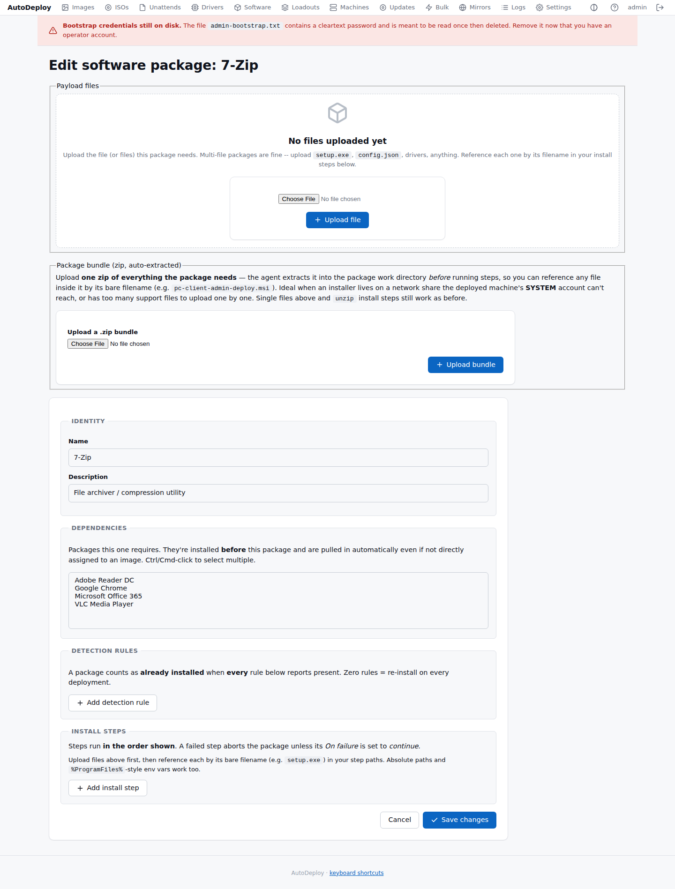
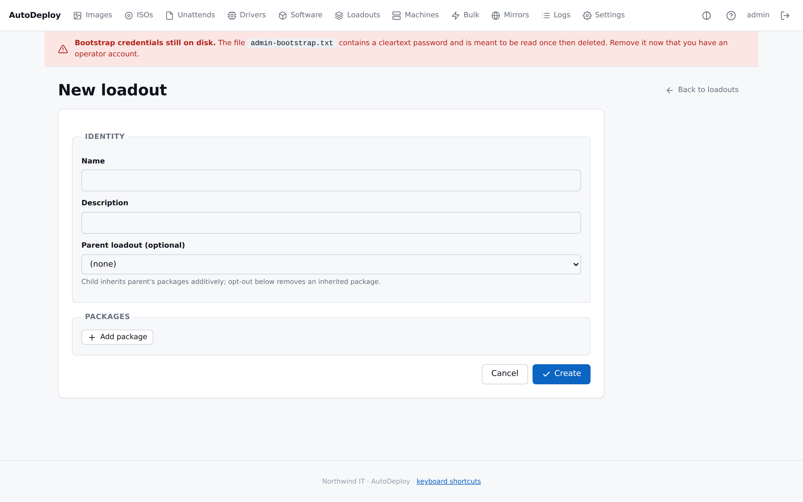
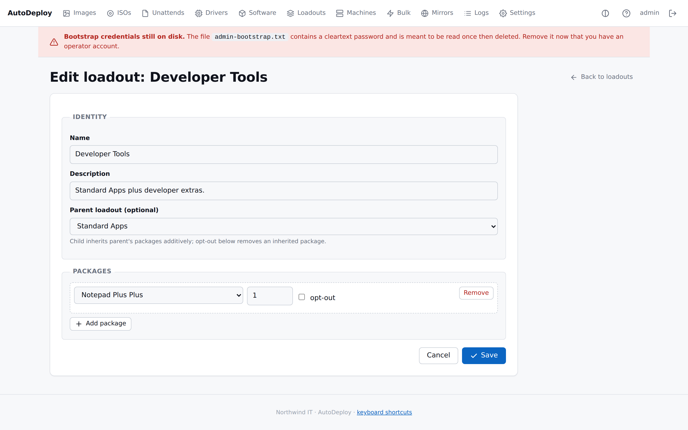

# Software packages & loadouts

AutoDeploy installs applications after Windows is up, using the [agent](../introduction.md#agent-autodeploy-agent).
You describe each application once as a **software package**, then group packages into
**[loadouts](#loadouts)** that you attach to images.

## Software packages

A software package defines **how to install** an application as a sequence of steps, **how to
detect** that it's already installed (so the agent can skip work it doesn't need to repeat), and
the **files** the install needs.

The list shows each package's **name**, **description**, and fleet compliance data:

| Column | Notes |
|--------|-------|
| Size | Total size of uploaded files |
| Used by | Number of images and loadouts that reference this package |
| Targets | Number of machines that should have this package (via image binding) |
| Installed | Number of target machines where the package is detected |
| Compliance | Percentage badge — green (100%), amber (partial), red (0%), or N/A if no targets |

### Creating a package

Go to **Software → New**. Give it a name and description, save, then upload the file (or files) it
needs and define its detection rules and install steps.

**Payload files.** A package can hold several files (e.g. `setup.exe` plus a `config.json`). The
agent downloads every file into a per-package work directory on the target; in your install steps
you reference each file by its bare filename and the agent resolves it to the on-disk path. Files
may also live in **sub-folders** — use the *Choose a folder* upload to bring a directory tree over
with its structure intact, then reference a nested file by its relative path (e.g. `drivers/oem.inf`).

**Package bundle (zip, auto-extracted).** For installers with many support files — or one that
lives on a network share the deployed machine's **SYSTEM** account can't reach — upload a single
**zip of everything the package needs**. The agent extracts it into the work directory *before*
running steps, so you can reference any file inside it by its bare filename (e.g.
`pc-client-admin-deploy.msi`). This is the reliable way to install from a UNC/SMB source: bring the
files local instead of having the SYSTEM account authenticate to the share. Single-file uploads
above and `unzip` install steps are unaffected — a bundle is auto-extracted, whereas an `unzip`
step extracts a zip you reference to a destination you choose.

**Dependencies.** A package can require other packages. They're installed before it and pulled in
automatically even if not directly assigned to an image.

**Detection rules.** A package counts as already installed when *every* rule reports present. Zero
rules means re-install on every deployment. Rule types:

| Type | Checks |
|------|--------|
| file | A file path exists (optionally a version / SHA-256) |
| registry | A registry key/value (optionally equals a value) |
| msi | An MSI product code is installed |
| script | A PowerShell or cmd script exits 0 |
| winget | A `winget_id` (e.g. `Microsoft.VisualStudioCode`) is reported present by `winget list --id <winget_id> --exact`; requires winget on the target |

**Install steps.** Steps run in order; a failed step aborts the package unless its *On failure* is
set to continue. Use the up/down arrows on each step to change the order without deleting and
re-adding it (the same arrows reorder detection rules). You can set per-step **success exit codes**
(e.g. add `3010` for installers that request a reboot). Step types:

| Type | What it does |
|------|--------------|
| copy | Copy a file to a destination |
| unzip | Extract a ZIP archive to a destination |
| msi | Install an MSI (`msiexec /quiet /norestart`) |
| appx | Install an APPX / MSIX package |
| exe | Run an EXE installer with arguments |
| cmd | Run a cmd.exe script |
| powershell | Run a PowerShell script |
| winget | Install a `winget_id` (required), with optional `winget_args` appended after `--silent`: runs `winget install --id <winget_id> --silent --accept-package-agreements --accept-source-agreements --disable-interactivity [winget_args]` |

Paths (and args) accept a bare uploaded filename, an absolute path, Windows environment variables
like `%ProgramFiles%`, or `%pkgdir%` (the package work directory). Environment variables are
expanded by the agent in **all** step paths, including **copy/unzip destinations** (so
`%ProgramData%\Microsoft\Windows\Start Menu\...` resolves to the real folder), and copy/unzip
**create the destination directory** if it doesn't exist. Steps also run **from the work
directory**, so a relative installer arg like `OfficeSetup.exe /configure NoTeams.xml` finds its
sibling file; use `%pkgdir%\NoTeams.xml` when you need the absolute path.

**Only run on this OS.** Each step has an optional *Only run on this OS* field. Leave it blank to run
on every OS, or enter part of the OS name (e.g. `Windows 11` or `Windows 10`) to run the step only on
machines whose OS matches — the match is a case-insensitive substring of the OS caption. On a
non-matching machine the step is **skipped**, not failed, so the rest of the package still runs. This
lets one package hold, say, a Windows 11 zip and a Windows 10 zip as two `unzip` steps and apply only
the one that fits each target.

For the full set of options and examples, see the references on
[detection rules](../reference/detection-rules.md) and
[install steps](../reference/install-steps.md).

## Loadouts

A loadout is a named **group of software packages** — for example "Standard apps" or "Engineering
tools". You attach loadouts to [images](images.md) rather than picking individual packages every
time, which keeps images tidy and consistent.

The list shows each loadout's **name**, **description**, its **parent** (rendered as a numeric ID,
if any), a **Packages** count, and a **Used by** count.

### Creating a loadout

Go to **Loadouts → New**, give it a **Name** (required) and optional **Description**, optionally
pick a **parent loadout**, then add the **software packages** to include. Each package row has an
**install order** and an **opt-out** checkbox.

### Parent inheritance

A loadout can have a **parent**. When it does, it **inherits the parent's packages additively** and
adds its own on top. To drop a package the parent included, add it as a row and tick **opt-out**.

This lets you build a base loadout (the apps every machine gets) and have team-specific loadouts
extend it — for example an "Engineering tools" loadout whose parent is "Standard apps", so machines
that get the engineering loadout receive both sets, minus any opt-outs.

When an image is resolved, AutoDeploy flattens loadouts (following parents and applying opt-outs)
together with the image's direct software links into a single ordered list. You can see the result
on the image's [Resolved view](images.md#the-resolved-view).

## Next steps

- Attach a loadout to an [image](images.md).
- Push software to already-deployed machines with [bulk operations](bulk-operations.md).
