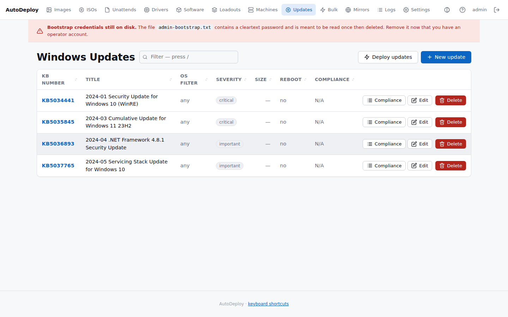
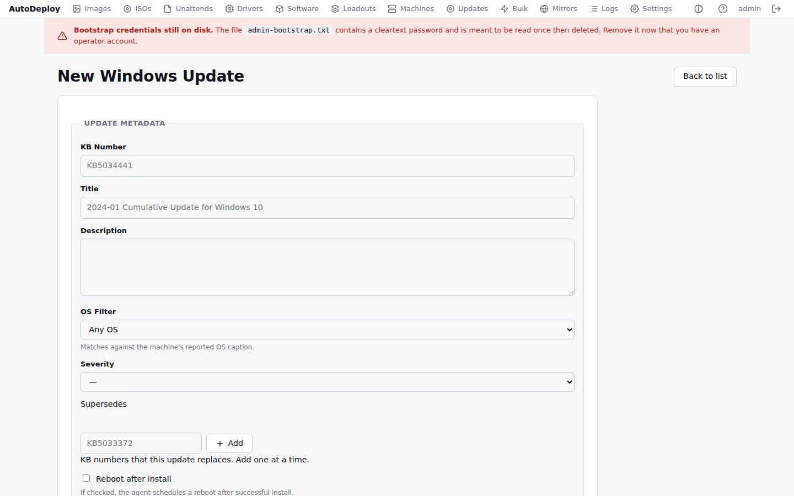
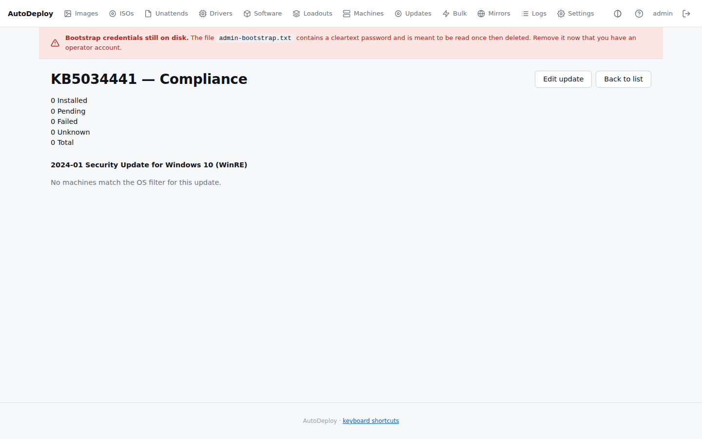
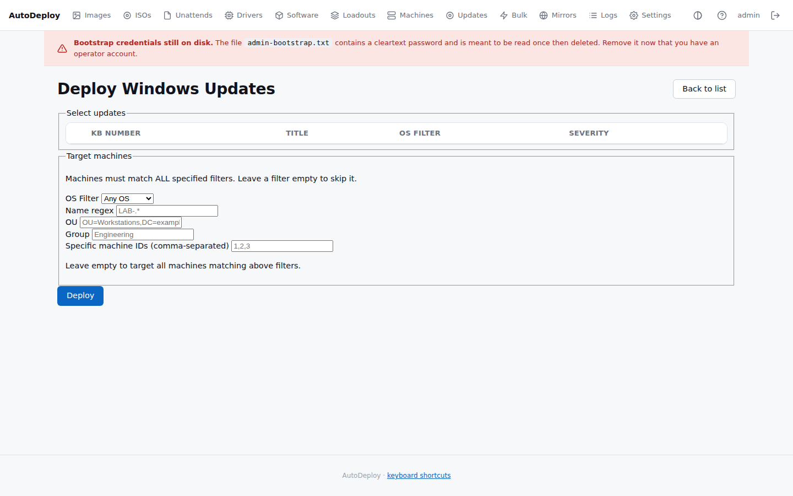

# Windows Updates

AutoDeploy tracks Windows Update KB patches as first-class entities. You define the updates you
care about — either by hand (create + upload the `.msu`) or by importing them straight from the
Microsoft Update Catalog — then deploy them across your fleet with OS-based targeting and
compliance tracking.

## Update list

The list shows each update's **KB number**, **title**, **OS filter**, **severity**, **size**,
**reboot** requirement, and **compliance** status. The compliance column shows how many targeted
machines have the update installed (e.g. "8 / 10 80%"), with a green badge at 100% and amber
otherwise.

## Creating an update manually

Go to **Updates → New**. Give it a **KB number** (e.g. KB5034441), **title**, optional
**description**, **OS filter** (e.g. "Windows 10" — matches machines whose OS caption contains this
string), and **severity** (critical, important, moderate, low).

After saving, upload the payload file — `.msu` or `.cab`. The agent downloads it and installs
`.msu` files with `wusa.exe /quiet /norestart` and `.cab` files with
`dism /Online /Add-Package`. Exit codes 0, 3010/1641 (reboot required), and "already installed"
all count as success; anything else marks the job failed with a readable reason visible on the
deployment detail page (hover the status badge).

If **Reboot after install** is checked, the agent schedules a restart (60-second delay) at the end
of a check-in cycle in which that update installed and the installer asked for a reboot. Without
the flag, the update finalizes at the machine's next natural restart.

## Importing from Microsoft

Instead of downloading an `.msu` yourself, go to **Updates → Import from Microsoft** (or use the
button on the update list). Search the Microsoft Update Catalog by KB number or keywords, then
click **Import** on the row you want — results show title, products, classification, date, and
size so you can pick the right OS/architecture variant. Only the first 25 catalog results are
shown, which covers any KB-number query.

The server downloads the file from Microsoft in the background (a progress bar tracks it) and
creates the update record with the KB number, title, OS filter, and severity pre-filled from the
catalog entry. Imported updates are ordinary updates: edit any field afterwards, or even replace
the payload manually. Nothing is imported or downloaded without an explicit operator action.

Notes:

- The server needs outbound HTTPS to `catalog.update.microsoft.com` and
  `*.download.windowsupdate.com` (the standard `HTTPS_PROXY` environment variable is honored).
  Air-gapped installs keep using manual upload.
- Importing a KB that's already tracked links you to the existing update instead of duplicating
  it; if the existing record has no payload yet, the import downloads into it.
- Catalog rows without a KB number (e.g. drivers) can't be imported.

## Compliance

Click the **Compliance** button on any update to see a per-machine breakdown of install status:
installed, pending, failed, or unknown.

The compliance view shows summary counts at the top and a per-machine table below, so you can
identify exactly which machines are missing a patch.

## Deploying updates

Click **Deploy updates** to push one or more updates to targeted machines. You can target by
machine name regex, OU, group, specific machine IDs, and OS filter. The deployment creates a
per-machine job for each selected update; the agent picks up queued jobs at its next check-in.

## Agent reporting

The agent reports installed KBs on each check-in. The server matches reported KB numbers against
tracked updates to compute compliance. Per-machine KB status is visible on the
[machine detail page](machines.md#history-and-detected-software).

## Next steps

- Review fleet-wide update compliance on the [dashboard](dashboard.md).
- Check per-machine KB status on the [machine detail page](machines.md).
