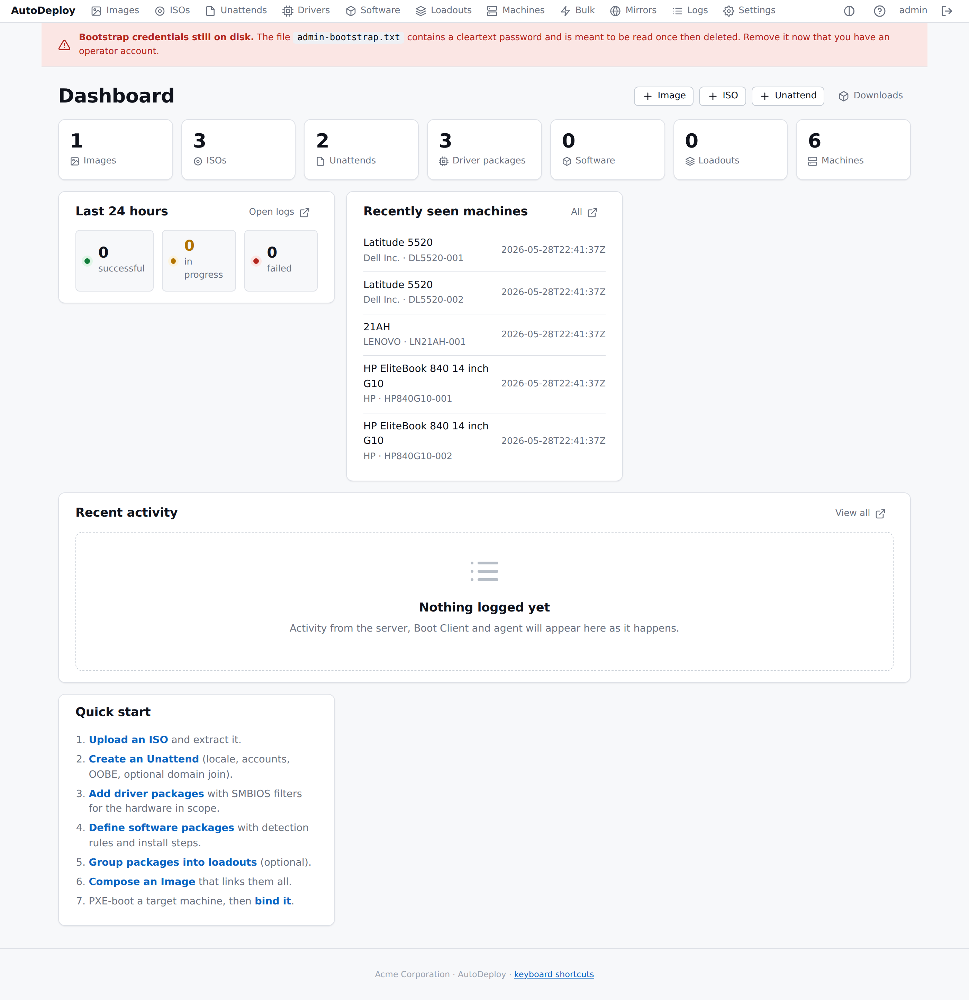
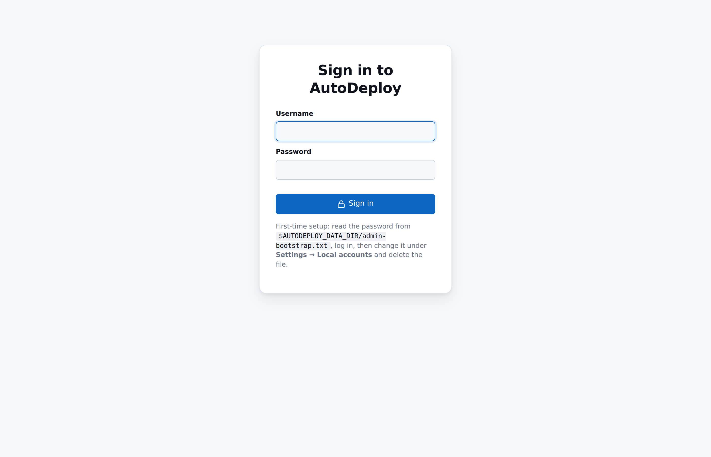
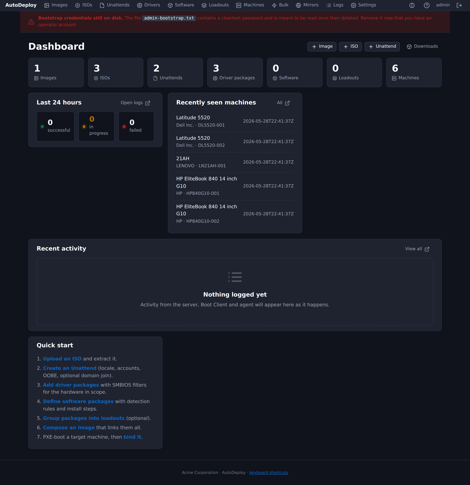
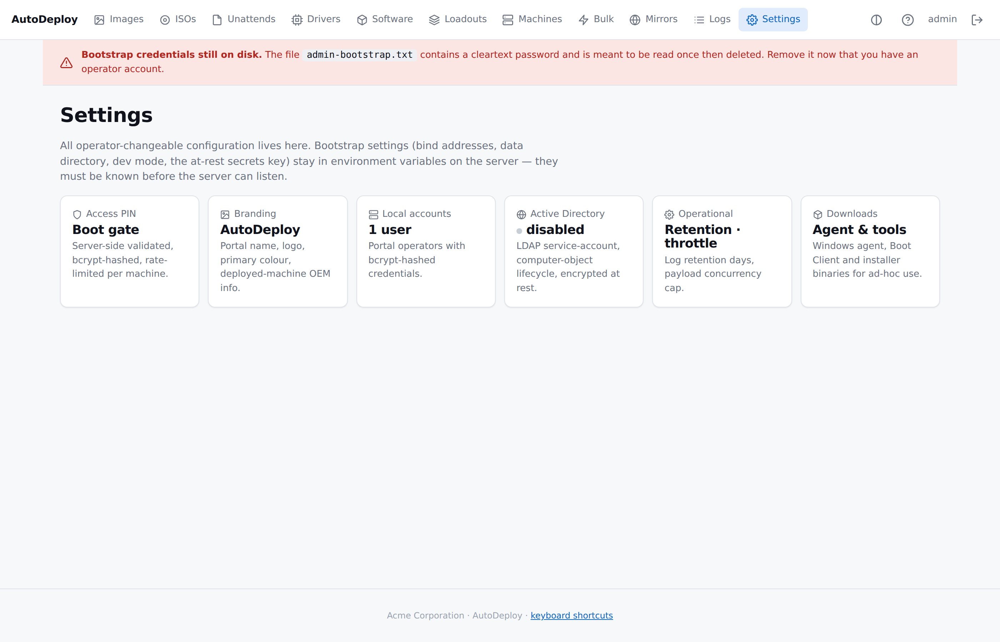

# AutoDeploy — Operator Guide

> A unified replacement for WDS / MDT / SCCM / FOG. Built around HTTP
> delivery, a single management portal, and a Linux pre-boot client
> that chainloads over iPXE.

This guide is the day-to-day reference for people who run AutoDeploy.
It walks you from a freshly downloaded release to a deployed Windows
machine, then dives into each subsystem. For the underlying design,
see [`docs/design/`](../design/).

---

## Start here

**First time? Read this:**

→ **[Getting started](getting-started.md)** — zero to a deployed
machine in 30–60 minutes. Download, install, configure DHCP/PXE,
upload an ISO, build an image, deploy.

→ **[Windows install](install-windows.md)** — same but for a Windows
host. Native Windows Service, no NSSM, no wrapper.

→ **[Concepts](concepts.md)** — five minutes to orient yourself in
the vocabulary (ISO / Unattend / Image / Driver / Loadout / Binding).

---

## Reference by area

### Setting it up

| | |
|---|---|
| [Concepts](concepts.md) | What AutoDeploy is, and the objects you work with. |
| [Installation (Linux)](installation.md) | Env vars, on-disk layout, systemd unit, install-linux.sh. |
| [Installation (Windows)](install-windows.md) | Native Windows Service, PowerShell installer, registry env block. |
| [Configuring the server](configuration.md) | Every env var, on-disk layout, **HTTP-only vs HTTPS** rules. |
| [PXE setup](pxe-setup.md) | DHCP patterns, classic PXE, UEFI HTTPBoot, the bridge to AutoDeploy. |

### Day-to-day artifacts

| | |
|---|---|
| [Payload uploads and delivery](payloads.md) | Uploading ISOs / drivers / software, HTTP Range, the manifest endpoint. |
| [Unattend configuration](unattend.md) | The structured 15-section editor, the generated XML, per-machine identity. |
| [Driver matching](driver-matching.md) | SCCM-style zip ingest, .inf metadata, SMBIOS filters, "use a machine as filter". |
| [Software packages](software.md) | Detection rules, ordered install steps, the agent flow. |
| [Software loadouts](loadouts.md) | Inheritable package collections, opt-outs, precedence. |
| [Inventory and bindings](inventory.md) | Machine records, bindings, deployment history, drift. |
| [Re-imaging](reimaging.md) | What re-imaging does, what's preserved, what isn't. |

### Operations

| | |
|---|---|
| [Boot Client and PXE](boot-client.md) | Building the initramfs, the iPXE chainload, the deploy flow. |
| [Active Directory integration](active-directory.md) | Service account, delete-and-replace lifecycle, group reconcile. |
| [Security](security.md) | Portal accounts, sessions, access PIN, rate limits, audit. |
| [BitLocker](bitlocker.md) | Per-machine PIN, escrowed recovery-key history, agent token. |
| [Bulk operations](bulk-operations.md) | Resident agent, AD-targeting, rename / software-push / scripts. |
| [Centralised logging](logging.md) | What's logged, ingest, search, secrets policy. |
| [Branding](branding.md) | The system-wide brand and where it shows up. |
| [Operating AutoDeploy](operations.md) | Deployment topology, backup/recovery, retention, security review. |
| [Scaling for mass deployments](scaling.md) | Payload mirrors per site, throttling, /metrics, thousands-at-once recipes. |

### APIs

| | |
|---|---|
| [API quick-start](api-quickstart.md) | `curl` recipes against the JSON API. |

---

## Using the portal

Everything you need is a structured form. You should **never** have to
craft JSON or edit XML by hand — the portal does both for you. The
JSON API at `/api/v1/` exposes the same surface for scripts and CI.

| | |
|---|---|
| **Sign in** |  Visit `https://your-host/portal/` or, in a local install, `http://127.0.0.1:8080/portal/`. First time only: read the password from `$AUTODEPLOY_DATA_DIR/admin-bootstrap.txt`, sign in, change it via Settings → Local accounts, then delete the file. |
| **Dashboard** |  Counters, 24-hour deploy outcomes, recently-seen machines, recent activity, a quick-start checklist. |
| **Dark mode** |  Toggle in the header (auto / light / dark cycle), remembered in localStorage. |
| **Settings** |  Five cards covering Access PIN, Branding, Local accounts, Active Directory and Operational settings, plus a Downloads page for distributable binaries. |

### Productivity helpers

The portal ships a small set of keyboard shortcuts and live behaviours:

- **`/`** focuses the filter box on any list page.
- **`g` then `i/m/l/s/u/d/w/o`** jumps to Images, Machines, Logs,
  Settings, Unattends, Drivers, soft**w**are, l**o**adouts.
- **`?`** opens the shortcut cheatsheet.
- Tables with the **`data-sortable`** attribute (most of them) sort
  by clicking column headers.
- Copy buttons next to any UUID / path / URL.
- The Logs page has a **Live tail** panel that polls every 4 s and
  pauses when the tab is hidden.

---

## At a glance

What you can manage from the portal today:

| Surface | Where |
|---|---|
| **Images** — compose ISOs + unattends + software into a deployable role | `/portal/images` |
| **ISOs** — upload + extract Windows install media | `/portal/isos` |
| **Unattends** — 15-section structured editor; generates XML at deploy | `/portal/unattends` |
| **Drivers** — SCCM zip upload, .inf scan, SMBIOS filters | `/portal/drivers` |
| **Software** — detection rules + ordered install steps | `/portal/software` |
| **Loadouts** — inheritable software collections with opt-outs | `/portal/loadouts` |
| **Machines** — SMBIOS-keyed inventory, bindings, deploy history | `/portal/machines` |
| **Bulk** — rename / script / push-package across selections | `/portal/bulk` |
| **Mirrors** — per-site payload mirrors for scale | `/portal/mirrors` |
| **Logs** — search + live-tail of every component's events | `/portal/logs` |
| **Settings** — branding, AD, accounts, PIN, retention, throttle | `/portal/settings` |
| **Downloads** — agent / Boot Client / installer binaries | `/portal/downloads` |

---

## Where to find things if a section is missing

The guide grows alongside the software. If a section you expect is
missing, the feature it documents has not yet shipped — check the
worklog at [`docs/design/WORKLOG.md`](../design/WORKLOG.md). Subsequent
work tracks the open questions from the design document (distributed
topology, point-in-time forensic restore, non-Windows target imaging,
graded portal roles, multicast bandwidth optimisation).
