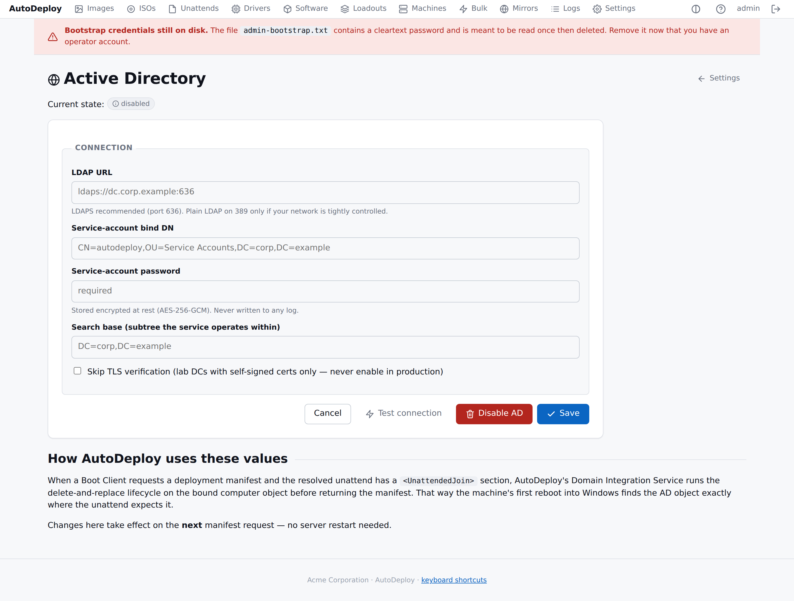

# Active Directory integration

> Server-side delete-and-replace lifecycle for the computer object,
> group-membership reconciliation, AD-coordinated bulk rename.

## The AD settings page



**Settings → Active Directory** is one form covering:

- **LDAP URL** — e.g. `ldaps://dc.corp.example:636`. LDAPS strongly
  preferred. Empty disables AD entirely.
- **Service-account bind DN** — the AD service account that runs
  AutoDeploy's operations.
- **Service-account password** — secret, AES-256-GCM at rest, never
  logged. Leave blank when editing to keep the existing value.
- **Search base** — AD subtree to operate within.
- **Skip TLS verification** — lab DCs with self-signed certs only.

Buttons:

- **Test connection** — dials the LDAP server, binds with the
  service account, runs a quick search. Result appears as a flash
  message.
- **Disable AD** — clears every AD setting (turning AD integration
  off without losing the rest of your portal configuration).
- **Save** — persists; changes take effect on the **next** manifest
  request, no server restart needed.

## Service-account permissions

The service account needs AD rights to:

- Create, delete, **rename** and modify computer objects in the
  target OUs (the rename is needed for the bulk-rename action).
- Modify group memberships for the groups your bindings reference.

No domain-admin equivalent is required; least-privilege is
recommended.

## When AD runs

The Domain Integration Service is invoked at two points.

### 1. Manifest endpoint (deploy time)

```
POST /api/v1/images/{id}/manifest    (with identity body)
```

When the resolved unattend has a `domain_join` section AND the
machine has a binding with `machine_name` and `target_ou`, the
server:

1. Searches the AD subtree for an existing computer object at
   `CN=<machine_name>,...`.
2. If found, **deletes it** (delete-and-replace lifecycle).
3. Creates a fresh computer object at the binding's `target_ou`.
4. Reconciles group memberships: removes the new object from any
   groups it ended up in but should not be in, adds it to the
   groups listed in `binding.group_memberships`.

Then the manifest returns to the Boot Client, the image is applied,
the unattend runs, and Windows joins the (now-prepared) domain.

### 2. Bulk rename (operator-triggered)

A bulk **rename** operation walks each targeted machine's binding,
calls `Service.RenameComputer` for each, then queues the local
`Rename-Computer` job for the agent. The AD object is renamed
**before** the local OS rename runs, so the secure-channel
handshake survives the reboot.

LDAP `ModifyDN` is used for the rename, with `sAMAccountName`
re-written to match the new CN (so the workstation trust account
stays consistent).

Failures land as `ad_warnings` in the response and as audit log
lines. The local OS rename still runs — some operators have
AD-unjoined targets in the same selection.

## Why delete-and-replace

The design accepts the trade-off explicitly:

- **Lost**: LAPS state stored against the old object's GUID.
- **Lost**: any custom AD attributes set on the old object outside
  AutoDeploy.
- **Preserved**: BitLocker recovery (AutoDeploy escrows recovery
  keys into its own inventory, keyed on hardware identity, not on
  the AD object).
- **Preserved**: group memberships, re-applied from the binding
  rather than copied from the old object.

If group membership reconciliation fails partway, the object
exists but groups are out of date. The server logs the failure
loudly; the operator can fix groups via the portal.

## Environment-variable seed (one-time, optional)

If you'd rather provision AD via configuration management:

```
AUTODEPLOY_AD_URL=ldaps://dc.corp.example:636
AUTODEPLOY_AD_BIND_DN=CN=autodeploy,OU=Service Accounts,DC=corp,DC=example
AUTODEPLOY_AD_BIND_PASSWORD=…
AUTODEPLOY_AD_SEARCH_BASE=DC=corp,DC=example
AUTODEPLOY_AD_SKIP_TLS_VERIFY=false
```

These values are read **only on first start** and only when the
corresponding portal setting is empty. Once you save anything
through the portal, the portal becomes the source of truth and
later changes to the env file are ignored — this avoids the
failure mode where two sources of truth silently drift apart.

## Logs

Every AD action emits a structured event:

```
addomain.prepare.start            actor=server  target=LAB-01    ou=OU=Lab,...
addomain.prepare.delete_existing  actor=server  target=CN=LAB-01,...
addomain.prepare.ok               actor=server  target=CN=LAB-01,OU=NewLab,...  groups=2
addomain.rename.start             actor=server  target=LAB-01    new_name=LAB-02
addomain.rename.ok                actor=server  target=CN=LAB-02,...
```

The service-account password is **never** included in any log line —
not on bind, not on failure. Only the fact and actor of AD
operations are recorded.
