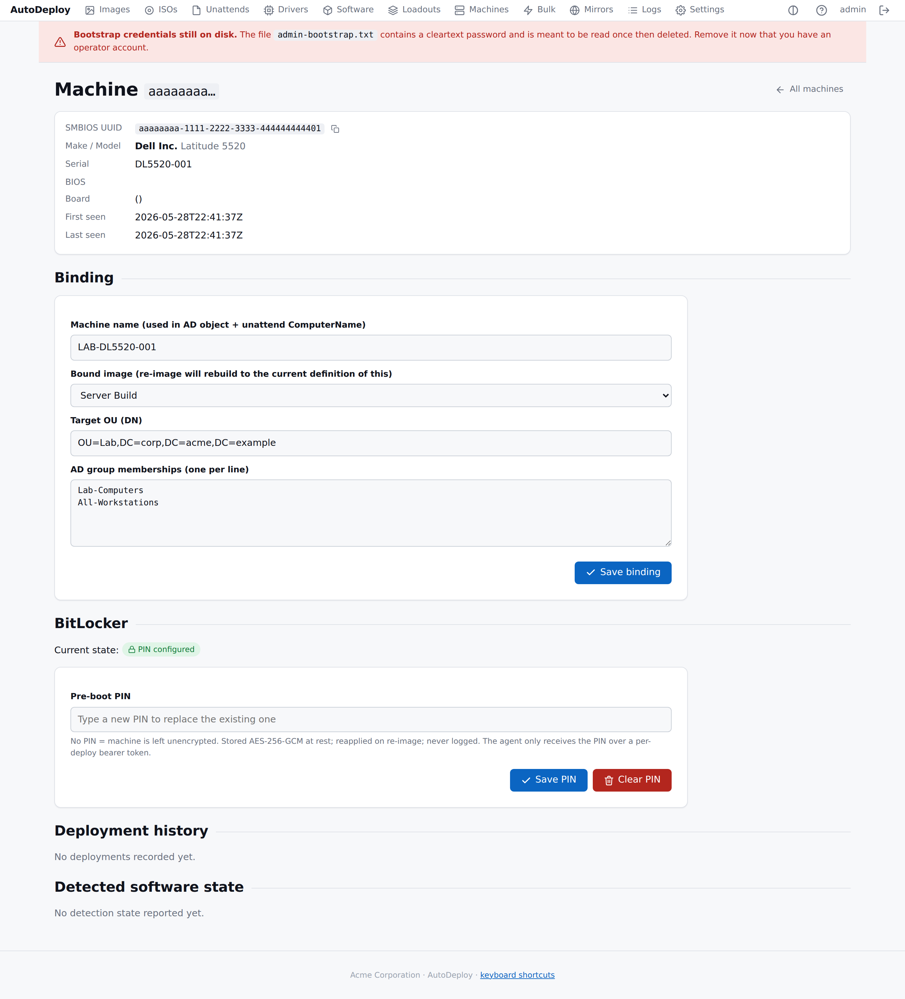

# BitLocker management

> Opt-in per machine via the inventory record. PINs and recovery keys
> are AES-256-GCM at rest; the recovery-key history is append-only.



The BitLocker section lives on each machine's detail page (above).
**No PIN = no encryption** — that's a deliberate, meaningful state,
not a missing setting.

## Setting a PIN

On the machine detail page (`/portal/machines/<id>`):

1. Scroll to **BitLocker**.
2. Type the new PIN in the **Pre-boot PIN** field.
3. **Save PIN**.

The agent picks it up next time it runs on this machine. To clear:
**Clear PIN** (confirmation dialog asks twice).

## What the agent does

On a fresh deploy, the agent:

1. Calls `POST /api/v1/agent/bitlocker/config` with its identity
   AND the **deploy token** the server issued during the agent's
   open report.
2. If the response has `pin_set: true`, it receives the cleartext
   PIN. The deploy token is required — having only the SMBIOS UUID
   isn't enough.
3. Calls `Enable-BitLocker -TpmAndPinProtector -EncryptionMethod
   Aes256 -UsedSpaceOnly -SkipHardwareTest` via PowerShell, feeding
   the PIN over stdin (never on the command line).
4. Reads the generated recovery key and posts it to
   `POST /api/v1/agent/bitlocker/escrow`.
5. Logs `bitlocker.enabled` — the FACT only; the recovery key value
   never appears in any log.

If no PIN is configured the agent logs `bitlocker.skip` and moves
on. On non-Windows hosts (the dev agent) BitLocker is unsupported
and the agent logs `bitlocker.unsupported`.

## Recovery keys: append-only history

Every escrow appends a new row. **Old keys are never overwritten**
so keys for previous encryption states stay available to unlock
historical drives or images.

The history table on the machine detail page lists every escrowed
key with timestamp and note; **Retrieve key** opens the audited
endpoint in a new tab. That retrieval emits a `secret.access` audit
event recording who retrieved which row — never the value.

## API surface

| Endpoint | Auth | Purpose |
|---|---|---|
| `PUT  /api/v1/machines/{id}/bitlocker/pin` | Portal session | Set or clear PIN. |
| `GET  /api/v1/machines/{id}/bitlocker` | Portal session | Status (no PIN value). |
| `GET  /api/v1/machines/{id}/bitlocker/pin` | Portal session | Retrieve PIN (audited). |
| `GET  /api/v1/machines/{id}/bitlocker/recovery-keys` | Portal session | History (no values). |
| `GET  /api/v1/recovery-keys/{id}` | Portal session | Retrieve specific key (audited). |
| `POST /api/v1/agent/bitlocker/config` | **Deploy token** | Agent fetches PIN at deploy. |
| `POST /api/v1/agent/bitlocker/escrow` | **Deploy token** | Agent escrows recovery key. |

The deploy-token requirement on the agent endpoints is the
authorization boundary that prevents a stolen SMBIOS UUID from
disclosing the PIN. See [Security](security.md) for the token
lifecycle.

## Re-imaging

The PIN is **preserved** across re-image — the user's pre-boot
experience is unchanged. The recovery key, however, **must change**
on re-image: the volume is wiped, the old encryption keys cease to
exist and a new recovery key is generated. The new key is escrowed
automatically; the old one stays in the history forever.

## At-rest encryption

PINs and recovery keys are encrypted with AES-256-GCM before they
hit SQLite. The encryption key is sourced from:

- `AUTODEPLOY_SECRETS_KEY` — hex-encoded 32 bytes (preferred for
  production).
- Auto-generated to `$AUTODEPLOY_DATA_DIR/secrets-key.bin` (mode
  0600) on first start when the env var is empty (dev mode
  convenience).

**Losing the key** means losing the ability to decrypt every
escrowed PIN and recovery key. Back up the key separately from the
database. The `scripts/backup.sh` and `scripts/windows/backup.ps1`
scripts include it in their archive.

## CLI examples (for CI / scripts)

```sh
# Set a PIN
curl -b cookie.txt -X PUT http://127.0.0.1:8080/api/v1/machines/1/bitlocker/pin \
    -H 'Content-Type: application/json' \
    -d '{"pin":"654321"}'

# Status (does NOT return the PIN value)
curl -b cookie.txt http://127.0.0.1:8080/api/v1/machines/1/bitlocker
# {"machine_id":1,"pin_set":true,"updated_at":"..."}

# Retrieve the PIN (audited; emits secret.access)
curl -b cookie.txt http://127.0.0.1:8080/api/v1/machines/1/bitlocker/pin
# {"pin":"654321"}

# Clear the PIN (machine will not be re-encrypted on next deploy)
curl -b cookie.txt -X PUT http://127.0.0.1:8080/api/v1/machines/1/bitlocker/pin \
    -d '{"pin":""}'

# Recovery-key history (no values)
curl -b cookie.txt http://127.0.0.1:8080/api/v1/machines/1/bitlocker/recovery-keys

# Retrieve a specific key (audited)
curl -b cookie.txt http://127.0.0.1:8080/api/v1/recovery-keys/42
```
