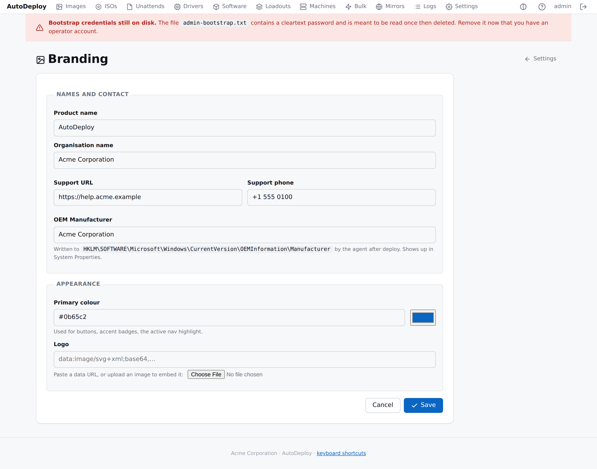

# Branding

> A single, system-wide organisational brand — configured once,
> applied everywhere AutoDeploy puts a label on something.

## The branding form



**Settings → Branding** is one form covering the entire identity
surface. The form includes:

- **Names and contact** — product name, organisation name, support
  URL, support phone, OEM manufacturer.
- **Appearance** — primary colour (with a live picker mirror), logo
  (paste a data URL or upload a file and the form converts it).
- **Logo preview** — shows the current logo above a contrasting
  background.

Click **Save**, and the change takes effect immediately on every
page.

## Where the brand shows up

| Surface | Field(s) used |
|---|---|
| Portal header / login / footer | `product_name`, `logo_data_url`, `primary_color`, `organisation_name` |
| Boot Client menu | `organisation_name`, `product_name` |
| Deployed Windows OEM | `oem_manufacturer`, `support_url`, `support_phone` |
| Portal favicon | Static AutoDeploy mark (does not change with the brand). |

## Boot Client integration

When the Boot Client opens the deploy menu, it fetches
`/api/v1/branding` and shows the org name + product name in the
header. Failure is silent (defaults to "AutoDeploy"); the operator
sees a clean header even when the brand fetch can't reach the
server.

## Agent integration (deployed-machine OEM info)

After the agent's first run on a freshly deployed machine, it
writes the brand fields to:

```
HKLM\SOFTWARE\Microsoft\Windows\CurrentVersion\OEMInformation
  Manufacturer = <oem_manufacturer>  (falls back to organisation_name)
  SupportURL   = <support_url>
  SupportPhone = <support_phone>
```

These values are what Windows shows in **Settings → System → About
→ Support**. The lock-screen and wallpaper writers are not yet
implemented.

## API

```sh
# Read (open — no auth)
curl http://127.0.0.1:8080/api/v1/branding

# Write (session required)
curl -b cookie.txt -X PUT http://127.0.0.1:8080/api/v1/branding \
    -H 'Content-Type: application/json' \
    -d '{
          "product_name":      "AutoDeploy",
          "organisation_name": "Acme Corporation",
          "support_url":       "https://help.acme.example",
          "support_phone":     "+44 1234 567890",
          "oem_manufacturer":  "Acme IT",
          "primary_color":     "#0b65c2",
          "logo_data_url":     "data:image/svg+xml;base64,PHN2Z…"
        }'
```

GET is open — the portal renders the brand before login, the Boot
Client fetches it to render the menu, and the agent fetches it
when applying OEM information.

## Anti-goals

- **Per-image branding.** Out of scope. Every image deploys the
  same brand.
- **Multi-tenant branding.** Out of scope. The brand is system-wide.

If you need either, run a separate AutoDeploy instance per brand.
