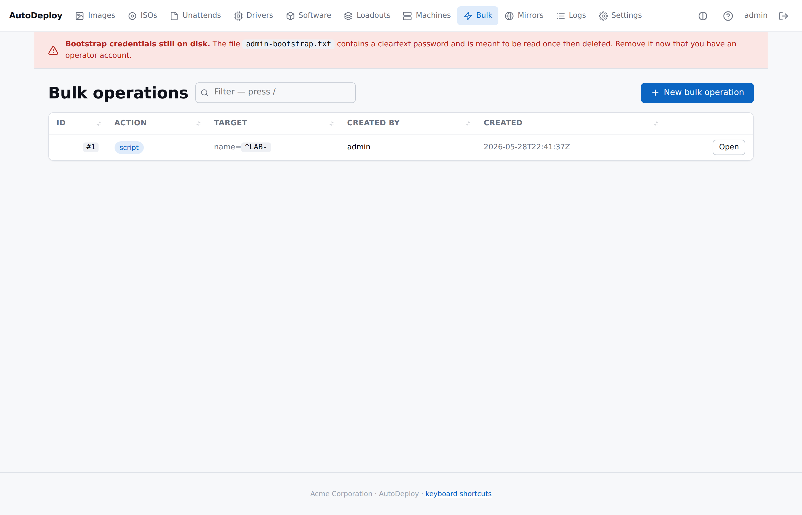
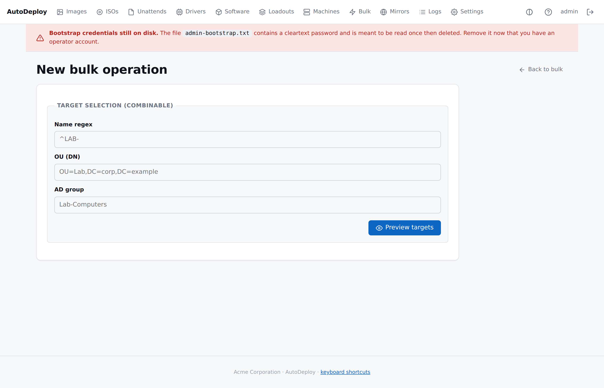

# Bulk operations

> Rename / script / software-push across a fleet selection. AD
> coordination runs server-side; agents pick up per-machine jobs at
> their next check-in.

## The Bulk list



Every operation you've created appears here, with action badge,
target summary (`name=`, `ou=`, `group=`), creator and timestamp.
Click **Open** to see the per-machine jobs.

## Creating an operation



**Bulk → New bulk operation** takes you to a two-stage form:

### Stage 1: target preview

Type any combination of:

- **Name regex** — `^LAB-` matches every binding name starting with
  `LAB-`.
- **OU (DN)** — exact match (case-insensitive) on the binding's
  target OU.
- **AD group** — case-insensitive match on the binding's group
  memberships.

Click **Preview targets**; the table below shows every machine that
would be touched. Empty fields are ignored. You can tweak the
filters and re-preview as many times as you need.

### Stage 2: action

Once the preview is right, fill in the action:

| Action | Payload shape | Notes |
|---|---|---|
| `rename` | `{"new_name":"LAB-02"}` | Server-side AD rename via the Domain Integration Service, then the agent's local `Rename-Computer -Force -Restart`. |
| `software_push` | A JSON array of `InstallStep` objects (or one step) | Re-uses the same detection + step executor as the deploy-time software install; idempotent. |
| `script` | `{"shell":"cmd","body":"..."}` or `{"shell":"powershell","body":"..."}` | Highest-risk action; every script run is audited. |

Click **Queue operation**; a styled confirm dialog asks you to
confirm against the target count. One bulk_job row is created per
target machine.

## What the resident agent does

When started with `--check-in 5m` (or similar), the agent loops:

1. POSTs identity (and deploy token) to `/api/v1/agent/checkin`.
2. Server resolves the machine, claims up to 8 queued jobs
   (marking them `running`), returns them.
3. Agent executes each job by dispatching on `action`:
   - `script` → `cmd /C` or `powershell -Command -` with the body
     on stdin.
   - `software_push` → runs the embedded install steps through the
     same executor as the deploy-time software install.
   - `rename` → `Rename-Computer -Force -Restart`.
4. Agent POSTs `{"status":"ok"|"failed","result_json":"..."}` to
   `/api/v1/agent/jobs/{id}/result`.
5. Sleeps the check-in interval, repeats.

Offline machines pick up their queue when they next come online —
the queue persists.

## AD coordination for rename

When the operation's action is `rename`, the server walks the
just-queued jobs and asks the Domain Integration Service to rename
each machine's AD computer object **before** the agent's local
rename runs. The sequence is **rename → directory update → reboot**.

Failures land in the response as `ad_warnings` and as audit log
events. The local rename still runs — some operators have
AD-unjoined targets in the same selection.

See [Active Directory integration](active-directory.md) for the
LDAP details.

## Safety

- **Bulk script** is the highest-risk action. Creating one requires
  an authenticated session; every operation row records the
  operator and the full target + payload. The portal asks for
  confirmation against the target count.
- **Bulk rename** triggers a reboot per machine. Pick a maintenance
  window.
- **Per-machine jobs** are claimed independently — slow machines
  don't block fast ones. The 8-job-per-check-in cap keeps any one
  machine from monopolising its own queue.

## API

```sh
# Preview without queueing
curl -b cookie.txt -X POST http://127.0.0.1:8080/api/v1/bulk/preview \
    -H 'Content-Type: application/json' \
    -d '{"name_regex":"^LAB-","ou":"OU=Lab,DC=corp,DC=example"}'

# Queue
curl -b cookie.txt -X POST http://127.0.0.1:8080/api/v1/bulk/operations \
    -H 'Content-Type: application/json' \
    -d '{
          "action":"script",
          "payload":"{\"shell\":\"powershell\",\"body\":\"Get-Service\"}",
          "target":{"ou":"OU=Lab,DC=corp,DC=example"}
        }'

# List
curl -b cookie.txt http://127.0.0.1:8080/api/v1/bulk/operations

# Inspect one
curl -b cookie.txt http://127.0.0.1:8080/api/v1/bulk/operations/42
```
