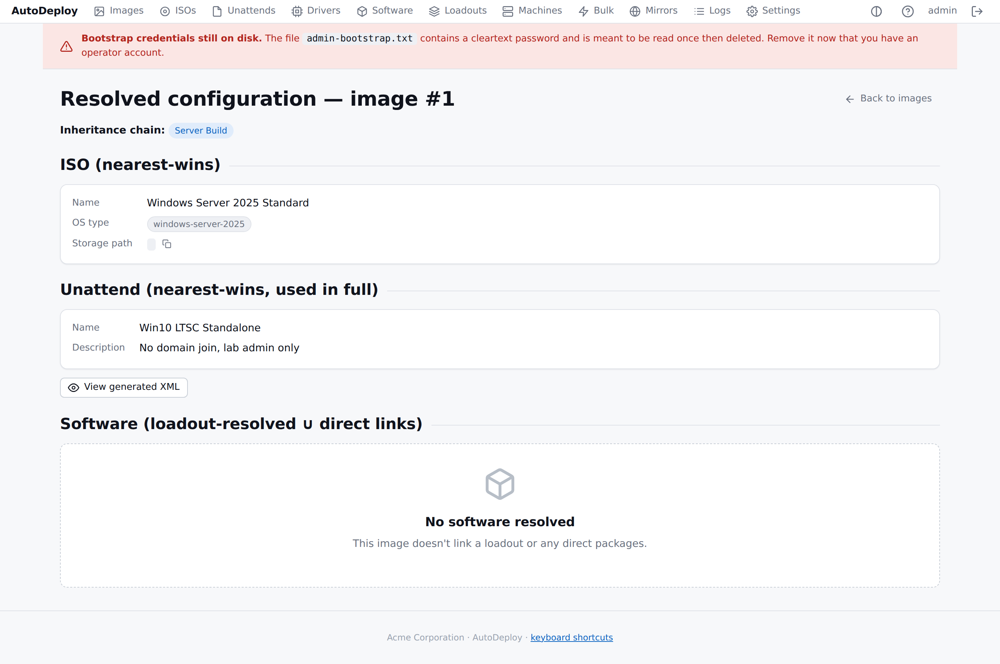

# Concepts

Five minutes of vocabulary so the rest of the guide reads naturally.

## The vocabulary

| Object | What it is | Where it lives |
|---|---|---|
| **ISO** | A Windows install ISO you upload. The server extracts the install.wim/esd so the Boot Client can apply it. | `/portal/isos` |
| **Unattend** | A structured deployment recipe — locale, accounts, OOBE, optional domain join, licensing, policies, first-logon commands. AutoDeploy generates the `unattend.xml` at deploy time. | `/portal/unattends` |
| **Driver package** | An SCCM-style zip of `.inf`-based drivers plus one or more **SMBIOS filters** that decide which machines it applies to. Global — no link from images. | `/portal/drivers` |
| **Software package** | An app installer (MSI / EXE / APPX / script) with **detection rules** (so re-runs are idempotent) and ordered **install steps**. | `/portal/software` |
| **Loadout** | An ordered, inheritable collection of software packages. One loadout can derive from another and override / opt out. | `/portal/loadouts` |
| **Image** | A composition: ISO + Unattend + (optionally) a Loadout + direct software links. Images can inherit from a parent image. | `/portal/images` |
| **Machine** | A row in inventory, keyed by SMBIOS UUID. Appears the first time a machine PXE-boots. | `/portal/machines` |
| **Binding** | A machine's assignment — bound name, target image, target OU, AD group memberships. Used during deploy and on re-image. | machine detail page |
| **Bulk operation** | A rename / script / software-push run against many machines at once. AD coordination is server-side. | `/portal/bulk` |

## How they connect

```
              ┌──────────┐
              │  ISOs    │
              └────┬─────┘
                   │  link
                   ▼
   ┌──────────┐  ┌────────┐  ┌──────────┐
   │ Unattend │──│ IMAGE  │──│ Loadout  │
   └──────────┘  └───┬────┘  └────┬─────┘
        (link)      │              │ ordered set of …
                    │              ▼
                    │       ┌──────────┐
                    │       │ Software │
                    │       │ packages │
                    │       └──────────┘
                    │
   ┌──────────┐     │    bind ┌────────────┐
   │  Driver  │     └────────►│  Binding   │
   │ packages │  (matched at  │  (per      │
   │ (global) │   deploy time)│   machine) │
   └──────────┘               └─────┬──────┘
                                    │
                                    ▼
                                ┌────────┐
                                │Machine │
                                │(SMBIOS)│
                                └────────┘
```

- **Drivers are global**. They are not linked from images — they
  apply to any machine whose reported SMBIOS matches one of the
  driver's filters. This keeps "Dell Latitude 5520 drivers" one
  package no matter how many images target that hardware.
- **Software is per-image OR per-loadout**. The effective set is the
  loadout (resolved up its own parent chain, with opt-outs honoured)
  ∪ the image's direct software links.
- **Unattend and ISO use nearest-wins resolution** up the image
  parent chain. A child image without an unattend inherits its
  parent's.

## Resolution rules

These rules run on the server when a Boot Client requests a manifest
for a given image. Source: `server/internal/resolve/`.

| Object | Rule |
|---|---|
| **ISO** | Nearest-wins up the image chain. |
| **Unattend** | Nearest-wins, used in full (no merging). Per-machine identity (computer name, target OU) is layered on at deploy time when a binding exists. |
| **Drivers** | All driver packages whose filters match the requesting machine's SMBIOS identity. No image link. |
| **Software** | Union of (a) the nearest loadout up the image chain, fully resolved up its own parent chain with opt-outs; (b) any direct software links on images in the chain. Duplicates dedup by package id; the nearest definition's order value wins. |

The "Resolved" view on any image shows what the resolver hands to a
requesting Boot Client right now:



## Lifecycle at a glance

1. **Operator** uploads ISOs, builds an unattend, uploads driver
   packages with filters, defines software with detection + install
   steps, composes images.
2. **Target machine** is configured by DHCP to PXE-boot AutoDeploy's
   iPXE chainload. It downloads the Boot Client kernel + initramfs
   over HTTP.
3. **Boot Client** reads SMBIOS, calls the server's menu endpoint
   with that identity. The operator picks (or "Re-image" picks
   automatically if a binding exists). The server resolves the
   image into a flat list of payload URLs.
4. **Boot Client** downloads each payload, partitions the disk,
   applies the WIM, extracts driver zips into
   `Windows\INF\AutoDeploy\<pkg>\`, writes `unattend.xml`, reboots.
5. **Windows** runs through OOBE using the unattend. The
   AutoDeploy **agent** is auto-installed by a first-logon command;
   it reports the deployment outcome and runs the software set,
   skipping anything detection rules report as already installed.
6. **Resident mode** (optional): the agent stays running and
   polls for bulk jobs every few minutes.

## Anti-goals

What AutoDeploy explicitly does NOT do, by design:

- Block-level disk cloning (FOG's model). File-based WIM/ESD only.
- macOS or Linux **target** imaging. The architecture allows it; not
  built today.
- Software authoring tooling. AutoDeploy deploys installers; it does
  not build them.
- Graded portal permissions. Every active account has full
  portal/API access. Accountability rests on the audit trail.
- Per-image or multi-tenant branding. The brand is system-wide.
- Merging of unattend objects up the chain. Each unattend is a
  complete answer file on its own.
- WMIC or WinPE in the boot environment. Identity comes from
  SMBIOS/DMI in a Linux pre-boot environment.
- Storing frozen historical images for routine re-imaging.
  Re-imaging is always to the current definition of the binding.

## Where TFTP fits in

Originally the design banned TFTP outright. The current product
clarifies that to **"no TFTP in the payload path"** — image, driver,
software and unattend downloads are HTTP only. A built-in TFTP
listener serves only the iPXE bootstrap binaries (`undionly.kpxe`,
`ipxe.efi`, `snponly.efi`) because classic PXE firmware can't HTTP
boot. Once iPXE has loaded, every subsequent transfer is HTTP(S).
Enable the listener with `AUTODEPLOY_TFTP_ADDR=:69`. See
[PXE setup](pxe-setup.md) for the DHCP and firmware story.
