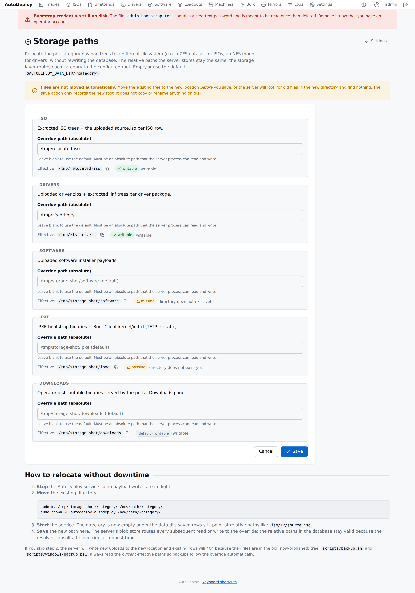

# Configuring the server

The server is configured by environment variables at boot. Runtime
operational settings (AD config, retention, throttle, branding, the
access PIN) live in the portal — see [Operating AutoDeploy](operations.md)
for the split between bootstrap (env) and runtime (portal) settings.

## TL;DR — does HTTPS matter for me?

| Scenario | What to set | What the server does |
|---|---|---|
| **Local dev / lab on your laptop** | Nothing | Plain HTTP on `127.0.0.1:8080`. No TLS material needed. |
| **Lab over the LAN, no PII** | `AUTODEPLOY_HTTP_ADDR=0.0.0.0:8080` | Plain HTTP bound to all interfaces. Works in any mode; production mode logs a `http.cleartext_public_bind` WARN at startup so the choice is auditable. |
| **Lab with self-signed HTTPS** | `AUTODEPLOY_HTTPS_ADDR=0.0.0.0:443` + `AUTODEPLOY_DEV=true` | HTTPS with a self-signed cert auto-generated under `$DATA_DIR/tls/`. Browsers warn; clients can `-k`. |
| **Production — HTTP only** | `AUTODEPLOY_HTTP_ADDR=0.0.0.0:8080`, `AUTODEPLOY_HTTPS_ADDR=`, `AUTODEPLOY_DEV=false` | Plain HTTP everywhere. Recommended only when a reverse proxy terminates TLS upstream, or for trusted-network LAN deployments. |
| **Production — HTTPS** | `AUTODEPLOY_HTTPS_ADDR=0.0.0.0:443`, `AUTODEPLOY_TLS_CERT`, `AUTODEPLOY_TLS_KEY`, `AUTODEPLOY_DEV=false` | HTTPS with your real cert. The recommended deployment. |

**HTTPS is fully optional and never enforced.** The server starts
with whatever bind addresses you give it. Cleartext HTTP on a
non-loopback address in production mode is permitted; it just logs
a clearly-marked warning at startup so the choice is on the record.

## Environment variables

### Bootstrap (must be known before the server starts)

| Variable                          | Default              | Meaning |
|-----------------------------------|----------------------|---------|
| `AUTODEPLOY_HTTP_ADDR`            | `127.0.0.1:8080`     | Cleartext HTTP bind. Empty disables. Non-loopback binds in production mode log a `http.cleartext_public_bind` WARN at startup — never refused. |
| `AUTODEPLOY_HTTPS_ADDR`           | `` (empty)           | HTTPS bind. Empty disables. |
| `AUTODEPLOY_TLS_CERT`             | `` (empty)           | PEM cert path for HTTPS. Optional. When `AUTODEPLOY_HTTPS_ADDR` is set and this is empty, the server auto-generates a self-signed cert under `$DATA_DIR/tls/`; production mode logs a WARN naming the consequence so the choice is auditable. Set to a CA-signed pair to silence the warning. |
| `AUTODEPLOY_TLS_KEY`              | `` (empty)           | PEM key path for HTTPS. |
| `AUTODEPLOY_TFTP_ADDR`            | `` (empty)           | UDP TFTP listener for the iPXE bootstrap (e.g. `:69`). Empty disables. Serves `$DATA_DIR/ipxe/` read-only. |
| `AUTODEPLOY_DATA_DIR`             | `./data`             | Root for the SQLite database, payload blobs, secrets key, etc. |
| `AUTODEPLOY_DEV`                  | `true`               | When `false`, dev-cert auto-generation is disabled. HTTP-only deployments are still supported; the server only warns, never refuses. |
| `AUTODEPLOY_SECRETS_KEY`          | `` (empty)           | Hex-encoded 32-byte at-rest encryption key for BitLocker PINs / recovery keys / AD bind password. Empty auto-generates a key file under `$DATA_DIR/secrets-key.bin` (mode 0600). |

### Runtime settings seeded by env (one-time)

These env vars **seed** values you can also edit through the portal.
After you save anything via the portal, the portal becomes the source
of truth and changes to the env file are ignored. See
[Operating AutoDeploy](operations.md) for the full split.

```
AUTODEPLOY_AD_URL, AUTODEPLOY_AD_BIND_DN, AUTODEPLOY_AD_BIND_PASSWORD,
AUTODEPLOY_AD_SEARCH_BASE, AUTODEPLOY_AD_SKIP_TLS_VERIFY,
AUTODEPLOY_LOG_RETENTION_DAYS, AUTODEPLOY_PAYLOAD_MAX_IN_FLIGHT
```

## Relocating storage from the portal

The categories under `$DATA_DIR/` — `iso/`, `drivers/`, `software/`,
`ipxe/`, `downloads/` — can each be relocated to a different
filesystem **from the portal**, without rewriting the database or
restarting the server. Source: `Settings → Storage paths`.



Each row shows:

- **Override path (absolute)** — the operator-configured root.
  Empty falls back to `$DATA_DIR/<category>`.
- **Effective** — the path the storage layer is currently routing
  to. Copy button to grab it for backup scripts etc.
- **State badge** — `writable` (green), `missing` (yellow — the
  override directory doesn't exist yet), or `default` (neutral —
  no override set).

**Files are not moved automatically.** The save action records the
new root; it does not copy or rename anything on disk. To relocate
without downtime:

1. **Stop** the AutoDeploy service.
2. **Move** the existing directory:

   ```sh
   sudo mv $DATA_DIR/iso /mnt/zfs/iso
   sudo chown -R autodeploy:autodeploy /mnt/zfs/iso
   ```

3. **Start** the service.
4. **Save** the new path in `Settings → Storage paths`. The storage
   layer routes every subsequent read/write to the override.

Existing database rows still point at relative paths like
`iso/12/source.iso`; the resolver consults the override at request
time so those paths stay valid through any number of relocations.

`scripts/backup.sh` and `scripts/windows/backup.ps1` read the
*current* effective paths so backups follow the override
automatically.

## On-disk layout

```
$AUTODEPLOY_DATA_DIR/
├── autodeploy.sqlite         # the relational store
├── secrets-key.bin           # AES-256-GCM key for at-rest encryption (mode 0600)
├── admin-bootstrap.txt       # one-time bootstrap admin password (delete after first login)
├── tls/                      # self-signed dev TLS material (dev mode only)
│   ├── dev-cert.pem
│   └── dev-key.pem
├── iso/{id}/
│   ├── source.iso            # the uploaded ISO
│   └── files/...             # extracted ISO contents (post-extract)
├── drivers/{id}/
│   ├── payload.bin           # the uploaded driver zip
│   └── files/                # extracted tree (post-extract)
│       └── metadata.json     # scanned .inf metadata
├── software/{id}/payload.bin # uploaded installer payload
├── ipxe/                     # iPXE bootstrap binaries + Boot Client kernel/initrd
│   ├── undionly.kpxe
│   ├── ipxe.efi
│   ├── snponly.efi
│   ├── autodeploy-kernel
│   └── autodeploy-initrd
└── downloads/                # binaries the portal Downloads page serves
    ├── autodeploy-agent-windows-amd64.exe
    └── autodeploy-boot-linux-amd64
```

## HTTP vs HTTPS — the full rules

The server has two listeners (`ListenAndServe` and
`ListenAndServeTLS`) that run independently. You configure whichever
you need. Source: `server/internal/httpx/server.go`.

**Plain HTTP listener** (`AUTODEPLOY_HTTP_ADDR`):

- Empty → no HTTP listener started.
- Set + `AUTODEPLOY_DEV=true` → listens on the configured address, any
  interface allowed.
- Set + `AUTODEPLOY_DEV=false` + bound to loopback (`127.0.0.1` / `::1`
  / `localhost`) → listens; intended for use behind a TLS-terminating
  reverse proxy.
- Set + `AUTODEPLOY_DEV=false` + bound to a non-loopback address →
  listens; emits a single `http.cleartext_public_bind` WARN at
  startup naming the risk and the mitigation. Cleartext HTTP is a
  permitted production deployment shape — the warning exists so the
  choice is auditable, not as a gate.

**HTTPS listener** (`AUTODEPLOY_HTTPS_ADDR`):

- Empty → no HTTPS listener started.
- Set + cert/key files supplied → listens with your cert.
- Set + cert/key empty + `AUTODEPLOY_DEV=true` → auto-generates a
  self-signed cert under `$DATA_DIR/tls/` and listens. Browsers and
  clients warn; that's expected. Logged at INFO.
- Set + cert/key empty + `AUTODEPLOY_DEV=false` → same auto-generation
  path, but the event is logged at WARN with the consequence spelled
  out: clients (browsers, agents, boot client) will fail TLS
  verification unless they trust the self-signed cert. The listener
  still starts. Set `AUTODEPLOY_TLS_CERT`/`KEY` to a CA-signed pair to
  silence the warning, or front the server with a reverse proxy that
  terminates TLS.

Both listeners can run side by side. The common production pattern is
HTTPS on `0.0.0.0:443` with HTTP loopback-only on `127.0.0.1:8080`
for local health checks.

## Recommended production setup

```sh
AUTODEPLOY_HTTPS_ADDR=0.0.0.0:443
AUTODEPLOY_HTTP_ADDR=127.0.0.1:8080
AUTODEPLOY_TLS_CERT=/etc/autodeploy/tls/server.crt
AUTODEPLOY_TLS_KEY=/etc/autodeploy/tls/server.key
AUTODEPLOY_DEV=false
AUTODEPLOY_DATA_DIR=/var/lib/autodeploy
AUTODEPLOY_SECRETS_KEY=<openssl rand -hex 32>
AUTODEPLOY_TFTP_ADDR=:69
```

Operators always reach the portal at `https://your-host/portal/`.
The loopback HTTP listener gives you a way to monitor `/healthz`
locally without a TLS round trip.
