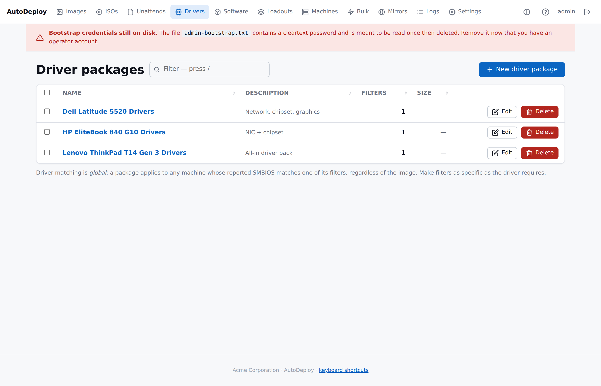
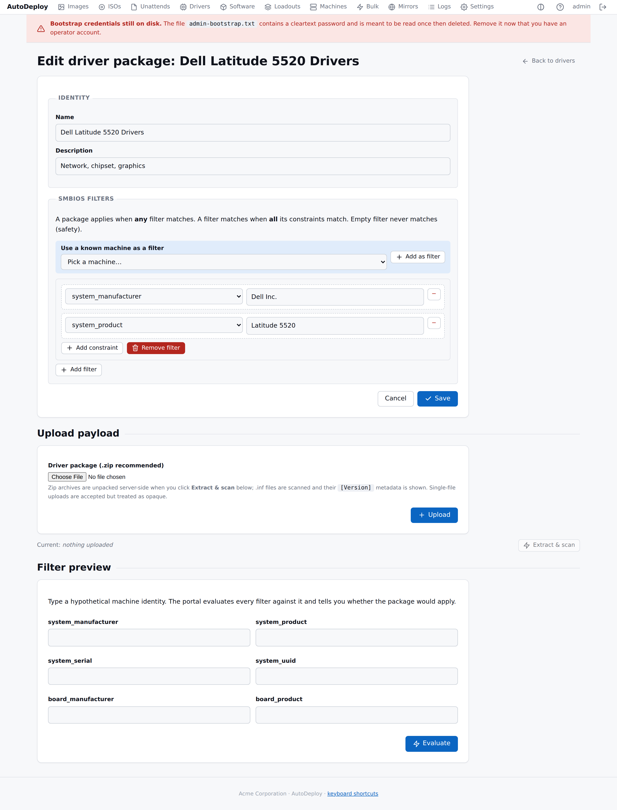

# Drivers

> SCCM-style driver packages with SMBIOS filters. Upload one zip,
> attach one or more filters, watch AutoDeploy match it to the right
> machines at deploy time.

## The driver list



The list page shows every package, its filter count, payload size,
sortable columns, copy-to-clipboard for any visible path, and
bulk-select for "delete 5 stale packages at once". Filter the list
with `/`.

## The flow

1. **Drivers → New driver package** → name + description → **Save**.
2. **Upload payload** — pick the SCCM `.zip` → streamed to
   `data/drivers/<id>/payload.bin`.
3. **Extract & scan** → server unpacks under
   `data/drivers/<id>/files/`, walks every `.inf`, parses the
   `[Version]` section (handles UTF-16 LE and ASCII INFs), persists
   `metadata.json`. The edit page now shows a **Discovered drivers**
   table.
4. **SMBIOS filters** — type by hand, OR pick a machine from the
   "Use a known machine as a filter" dropdown and click **Add as
   filter** to seed `system_manufacturer` + `system_product` from
   inventory in one click.
5. **Filter preview** lets you type a hypothetical SMBIOS identity
   and confirm the package would apply before any real PXE boot.

## The edit page



The edit page bundles everything for one package:

- **Identity** — name, description.
- **SMBIOS filters** — the operator-controlled match rules. Above
  the filter blocks is the **Use a known machine as a filter**
  helper (only visible when you have inventoried machines).
- **Upload payload** — the file picker + an Extract & scan button
  (disabled until you've uploaded).
- **Discovered drivers** — appears after extract. One row per `.inf`
  found in the zip with Class, Provider, Version and Date.
- **Filter preview** — type a hypothetical SMBIOS identity and the
  server tells you whether your package would apply.

## SMBIOS filters

A driver package applies when **any** filter matches. A filter
matches when **all** its constraints match. An empty filter never
matches (safety).

A constraint is a `(key, value)` pair. The allowed keys are the
SMBIOS fields the Boot Client reports:

| Key | DMI source |
|---|---|
| `system_manufacturer` | DMI type 1 |
| `system_product` | DMI type 1 |
| `system_serial` | DMI type 1 |
| `system_uuid` | DMI type 1 |
| `bios_vendor` | DMI type 0 |
| `bios_version` | DMI type 0 |
| `board_manufacturer` | DMI type 2 |
| `board_product` | DMI type 2 |
| `board_serial` | DMI type 2 |

Values match **exact** (case-insensitive, whitespace-trimmed). A
literal `*` value matches "any non-empty" — useful when you only
care that the field exists.

Common patterns:

| Goal | Filter |
|---|---|
| One specific laptop model | `system_manufacturer=Dell Inc.` + `system_product=Latitude 5520` |
| Every machine of a vendor | `system_manufacturer=LENOVO` |
| One specific motherboard | `board_manufacturer=Supermicro` + `board_product=X11SCH-F` |

## "Use a known machine as a filter"

Above the filter blocks on the edit page, a dropdown lists every
inventoried machine whose SMBIOS has a make + model. Pick one and
click **Add as filter**; the form creates a new filter block
pre-populated with `system_manufacturer = <value>` and
`system_product = <value>`. You can edit either before saving.

This is the highest-leverage shortcut for shops with 10+ hardware
models — boot one of each, then use them as filter sources for
their respective driver packs.

## Why drivers are global (not linked from images)

A given driver pack (say "Dell Latitude 5520") applies to that
hardware regardless of which Windows image you deploy. Linking
drivers per-image would force you to maintain N×M packages.

Instead, the manifest endpoint evaluates every driver package's
filters against the requesting machine's SMBIOS identity and ships
the matches. Duplicates across packages are fine — each extracts
into its own subdirectory under `Windows\INF\AutoDeploy\<pkg>\` on
the target; Windows PnP picks the best driver per device.

## The on-disk layout (after upload + extract)

```
$AUTODEPLOY_DATA_DIR/drivers/<id>/
├── payload.bin                # the uploaded zip (single copy)
└── files/                     # post-extract tree
    ├── metadata.json          # what the server scanned
    ├── Intel/
    │   └── Ethernet/
    │       ├── e1d65x64.inf
    │       └── e1d65x64.sys
    └── ...
```

The **Boot Client downloads `payload.bin`** (the original zip),
extracts it locally, and copies the tree into
`<mount>\Windows\INF\AutoDeploy\<package-id>\`. The server-side
`files/` directory exists for portal visibility (showing what's
inside) and for the agent's drift-reporting.

## Editing filters via the portal

| Action | Effect |
|---|---|
| **Add filter** | A new filter block starts with one `system_manufacturer` constraint. |
| **Add constraint** | Add another `(key, value)` row to the same filter — all constraints in a filter must match. |
| **Remove filter / constraint** | Right-aligned per-row buttons. |
| **Use machine as filter** | Builds a filter from an inventoried machine in one click. |

## Filter preview

The **Filter preview** section at the bottom of the edit page lets
you type a hypothetical SMBIOS identity. The portal evaluates every
filter against it and shows:

- A **Package matches** badge (green / red).
- One row per filter with its own match/no-match.

Use this whenever you change a filter to verify your intent.

## SCCM ingest format

The portal accepts a `.zip` archive of the SCCM driver source tree.
The server:

- Refuses path traversal (`../`, absolute paths, etc.).
- Caps total extracted size at 8 GiB.
- Walks `.inf` files at any depth.
- Parses the `[Version]` section for `Class`, `Provider`, `DriverVer`.
- Handles both UTF-16 LE (Microsoft tooling's default) and ASCII INF
  encodings.

Single-file uploads (non-zip) are accepted but treated as opaque —
they're shipped to the Boot Client as-is and dropped into the same
`INF\AutoDeploy\<pkg>\` directory. The portal warns that single
files don't get metadata parsing.

## Pitfalls

- **Over-broad filters.** A filter like
  `{"system_manufacturer":"Dell Inc."}` matches every Dell machine;
  if the package contains drivers for one specific model, that is a
  problem. Make filters as specific as the driver requires; use the
  preview to sanity-check.
- **No filters = never injected.** A driver package with an empty
  filter set never matches anything. Add at least one filter with at
  least one constraint.
- **Driver matching is global.** Two images deploying to the same
  hardware get the same drivers.

## API

For CI tooling: the same flow over JSON.

```sh
curl -X POST http://127.0.0.1:8080/api/v1/drivers \
    -H 'Content-Type: application/json' \
    -d '{
          "name": "Dell-Latitude-5520",
          "description": "NIC, GPU, chipset for Latitude 5520",
          "filters": [
            {"filter_json": "{\"system_manufacturer\":\"Dell Inc.\",\"system_product\":\"Latitude 5520\"}"}
          ]
        }'

curl -X PUT --data-binary @driverpack.zip \
    http://127.0.0.1:8080/api/v1/drivers/12/upload

curl -X POST http://127.0.0.1:8080/api/v1/drivers/12/extract

curl -X POST http://127.0.0.1:8080/api/v1/drivers/12/preview \
    -H 'Content-Type: application/json' \
    -d '{"system_manufacturer":"Dell Inc.","system_product":"Latitude 5520"}'
```

The Boot Client side is automatic — when it requests a manifest the
server includes any matching driver packages.
