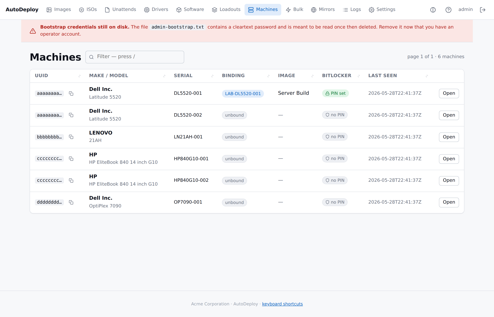

# Inventory and bindings

> Every machine that boots AutoDeploy appears here. Bindings link it
> to its assigned configuration; deployment history is append-only.

## The machine list



The list shows every recorded machine with sortable columns: UUID
(short-form + copy-to-clipboard for the full one), make/model,
serial, binding status, bound image, BitLocker state, last seen.
Filter with `/`. Above 50 machines the list paginates with
**Showing N–M of T** in the header.

## The machine record

Keyed on **SMBIOS UUID** (with serial as a secondary identifier),
each row carries the firmware identity the Boot Client reports plus
first-seen / last-seen timestamps. A machine is created
automatically the first time its Boot Client reports identity to
the server — no operator step needed.

## The detail page


The detail page shows:

- **Header card** — SMBIOS identity (UUID with copy button, make,
  model, serial, BIOS, board, first/last seen).
- **Binding** — name, bound image, target OU, AD group memberships.
- **BitLocker** — current state, PIN field, recovery-key history if
  any.
- **Deployment history** — sortable table of every deploy attempt
  with outcome badges (ok / failed / in_progress).
- **Detected software state** — what the agent's last drift report
  said for each linked package.

## Bindings

A binding is what the machine is **assigned to**:

| Field | Used by |
|---|---|
| `machine_name` | Layered into the unattend's `<ComputerName>` at deploy. Also the CN in AD. |
| `image_id` | Resolves to the boot menu's **Re-image** action and the deploy manifest. |
| `target_ou` | Layered into the unattend's `<MachineObjectOU>` (when domain join is configured) AND used by the Domain Integration Service to place the AD object. |
| `group_memberships` | Reconciled in AD after the computer object is (re-)created. |

Once a binding exists, the Boot Client menu offers a **Re-image**
option for that machine — rebuilding the binding's image against
the **current** definition (not a frozen snapshot).

If the bound image is deleted, the binding's `image_id` is set to
NULL rather than the binding being removed. The binding is the
machine's *assignment*, separate from the image that currently
fulfils it.

## Deployment history

Append-only. The agent opens an `in_progress` row at the start of a
deploy and updates it to `ok` or `failed` at the end.

Each row: `started_at`, `completed_at`, `image_id`, `outcome`,
`notes`. This is an **audit log**, not a replay manifest —
re-imaging always uses the latest definition of the bound
configuration, never a historical snapshot.

## Detected state and drift

The agent reports per-package detection state in its final report.
This is persisted as `machine_detected_state` and shown on the
machine detail page under **Detected software state**.

```json
"packages": [
  {"package_id": 10, "detected": true,  "installed": true,  "failed": false},
  {"package_id": 11, "detected": false, "installed": false, "failed": true}
]
```

Operators use this to spot drift: a package that should be present
but `detected: false` means something removed it.

## SMBIOS identity is opt-in for the agent

The Windows agent reads its SMBIOS UUID via:

1. `Get-CimInstance Win32_ComputerSystemProduct` (the supported
   modern path).
2. `wmic csproduct get UUID` (legacy fallback).
3. Normalised to a 36-char hyphenated lower-case form.

Without a UUID the agent can't identify itself to the server and
inventory upsert / BitLocker config / bulk-job claims silently
break. The Boot Client side reads `/sys/class/dmi/id/product_uuid`
on its Linux pre-OS environment.

## API

```sh
# List
curl http://127.0.0.1:8080/api/v1/machines

# Lookup
curl http://127.0.0.1:8080/api/v1/machines/1

# Bind
curl -b cookie.txt -X PUT http://127.0.0.1:8080/api/v1/machines/1/binding \
    -H 'Content-Type: application/json' \
    -d '{"image_id":7,"machine_name":"LAB-01",
         "target_ou":"OU=Lab,DC=corp,DC=acme,DC=example",
         "group_memberships":["Lab-Computers","All-Workstations"]}'

# History
curl http://127.0.0.1:8080/api/v1/machines/1/history

# Detected state
curl http://127.0.0.1:8080/api/v1/machines/1/detected
```
