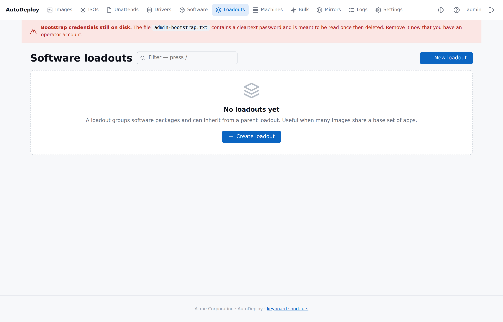

# Software loadouts

> Ordered, inheritable collections of software packages. Many images
> share the same set; changes ripple to every image that links the
> loadout.



## Why loadouts

Without loadouts, every image would either have to list every
package it wants or stack them through image inheritance. Loadouts
let you say:

- "All workstations get the base loadout."
- "Lab workstations get base + lab tools."
- "Finance workstations get base + finance tools, minus the lab
  video editor."

The same package set can be shared by many images; changes ripple
to every image that links the loadout.

## Shape

```json
{
  "name": "lab-base",
  "description": "Common lab tools",
  "parent_id": 1,
  "packages": [
    {"package_id": 10, "order_value": 100},
    {"package_id": 11, "order_value": 200},
    {"package_id": 12, "order_value": 300, "opt_out": true}
  ]
}
```

| Field | Meaning |
|---|---|
| `name`, `description` | Display fields. |
| `parent_id` | Optional — inherit from another loadout. |
| `packages[].package_id` | The software package. |
| `packages[].order_value` | Install order. Lower = earlier. |
| `packages[].opt_out` | `true` removes an inherited entry. |

## Resolution

For an image whose `loadout_id` points at loadout L:

1. Walk L's parent chain from the eldest ancestor down. At each
   level, record the loadout's package set, with descendants
   overriding ancestors:
   - Same `package_id` in a descendant **replaces** the ancestor's
     `order_value`.
   - `opt_out: true` in a descendant **removes** the package from
     the resolved set (even if added by an ancestor).
2. Sort the merged set by `order_value`, then by `package_id`.
3. Union with the image's `software_links` (direct package links).
   On conflict, the direct link wins — its `order_value` is used
   and the loadout's entry is dropped.

This matches the design's deliberate asymmetry:

- ISO and unattend are **nearest-wins** (one each per image chain).
- Drivers are **global-match** (hardware-driven, image-independent).
- Software is **additive**, with explicit opt-out and a clear
  precedence rule (direct links beat loadout entries beat ancestor
  entries).

## Editing in the portal

The form is a repeating table of `(package, order, opt-out)` rows
plus the parent-loadout dropdown. Use the "Resolved" view on any
image to see exactly what the final package set looks like after
loadout walking.

## Guards

- **Cycle detection.** A child cannot make an ancestor its own
  descendant. Saving such a structure returns 422.
- **Reference-count guard.** A loadout cannot be deleted while an
  image still links it or another loadout names it as parent.
  Resolve the references first.
- **Package reference count.** A software package's reference count
  is `direct image links + loadout memberships`, so packages used
  only by a loadout are protected from deletion too.

## API

```sh
# Create
curl -X POST http://127.0.0.1:8080/api/v1/loadouts \
    -H 'Content-Type: application/json' \
    -d '{"name":"base","packages":[
          {"package_id":1,"order_value":100},
          {"package_id":2,"order_value":200}
        ]}'

# Inherit
curl -X POST http://127.0.0.1:8080/api/v1/loadouts \
    -H 'Content-Type: application/json' \
    -d '{"name":"lab","parent_id":1,"packages":[
          {"package_id":3,"order_value":150}
        ]}'

# Link a loadout to an image
curl -X PUT http://127.0.0.1:8080/api/v1/images/5 \
    -H 'Content-Type: application/json' \
    -d '{"name":"lab-image","loadout_id":2}'

# Resolved (includes unioned package list)
curl http://127.0.0.1:8080/api/v1/images/5/resolved
```
