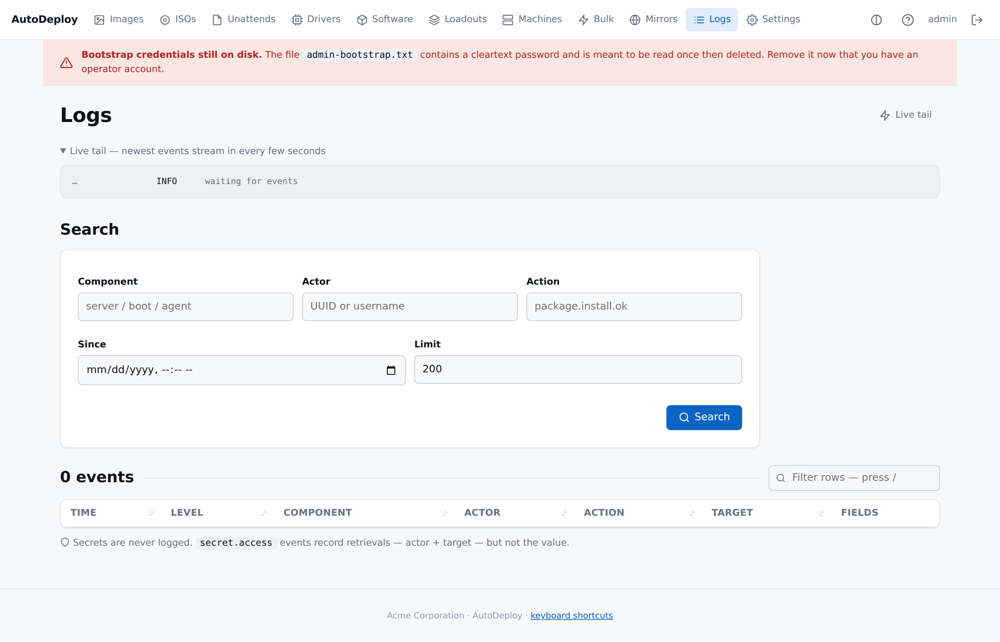

# Centralised logging

> Every component (server, Boot Client, agent) ships structured
> events to one database. The portal renders them with search
> filters, live tail, and per-component badges.

## The Logs page



The Logs page combines:

- **Live tail** at the top — newest events stream in every 4 seconds.
  Pauses automatically when the tab is hidden so background tabs
  don't burn CPU.
- **Search form** with component / actor / action / since / limit
  filters. Submit hits `GET /api/v1/logs`.
- **Results table** with sortable headers, level badges (INFO /
  WARN / ERROR), and the raw JSON `fields` for each row.
- **Filter rows** — type into the per-table filter to narrow the
  visible result set without re-querying.

## What is logged

Every event captures these fields:

| Field | Value |
|---|---|
| `actor` | Who initiated the action — portal username, machine UUID, or `system`. |
| `action` | Dotted name like `package.install.ok`. |
| `component` | Emitting component (`server`, `boot`, `agent`). |
| `target` | The object acted on (machine id, image id, path, etc.). |
| `occurred_at` | UTC timestamp. |
| `level` | INFO / WARN / ERROR. |
| `fields` | Extra structured attributes as JSON. |

## Where events come from

| Source | How they arrive |
|---|---|
| **Server itself** | Direct write to the `log_event` table via the `model.LogRepo`. Every HTTP request emits one row. |
| **Boot Client** | Buffered in memory by the `logging.Shipper`; flushed via `POST /api/v1/logs/ingest` before reboot (and on every fail path). |
| **Agent** | Same shipper pattern. One-shot mode flushes on exit; resident mode flushes every check-in tick. |

The buffer is bounded (2048 events, oldest-drop policy) so a stuck
upload can't grow without bound.

## The ingest endpoint

```
POST /api/v1/logs/ingest
{ "events": [
    {"component":"boot","level":"INFO","actor":"<uuid>","action":"deploy.apply.start",
     "target":"/dev/sda","fields":"{\"dry_run\":false}"}
] }
```

Protections:

- Body capped at **256 KiB** per request.
- Maximum **500 events** per request.
- **Per-IP token bucket**: 50 burst, 10 refill/sec. A flooding
  client gets 429s without affecting other clients.
- **Best-effort secret tripwire**: requests whose JSON payload
  contains `"pin":"…"`, `"password":"…"`, `"recovery_key":"…"`
  are rejected at the gateway. Bug at the emitter, not a value to
  silently store.

## Searching via the API

```sh
curl -b cookie.txt 'http://127.0.0.1:8080/api/v1/logs?component=boot&since=2026-05-28T00:00:00Z&limit=200'
```

| Query param | Meaning |
|---|---|
| `component` | Exact match on emitting component. |
| `actor` | Exact match on actor field (UUID or username). |
| `action` | Exact match on action name. |
| `since` | RFC3339 lower bound. |
| `until` | RFC3339 upper bound. |
| `limit` | Up to 10000, default 1000. |

Results are newest first.

## Retention

`log_event` rows are pruned by an in-server scheduler that ticks
hourly. Set the retention window in **Settings → Operational** (or
seed it with `AUTODEPLOY_LOG_RETENTION_DAYS`). 0 disables pruning
and the table grows forever.

```
Settings → Operational → Keep log events for (days)
```

The prune emits its own `retention.log_prune.ok` log line with the
row count it removed — handy for verifying the scheduler is alive.

## Secrets, again

Detailed logging is the system-wide rule; **secrets are the
absolute exception**. PINs, recovery keys, passwords and AD bind
credentials **never** appear in any log row, in `fields`, or in any
error or HTTP response that ends up in `fields`. The fact and
actor of a secret retrieval DO appear (as a `secret.access`
event), so that sensitive accesses are attributable.

## Common queries

| What you want to know | Filter |
|---|---|
| Every deploy outcome in the last 24h | `component=agent`, `action=agent.done`, `since=<24h ago>` |
| BitLocker secret retrievals | `action=secret.access`, `target=bitlocker.*` |
| Boot Client errors only | `component=boot`, then filter rows by `level=ERROR` |
| One machine's history | `actor=<smbios-uuid>` |
| Operator's session | `actor=portal:<username>` |
