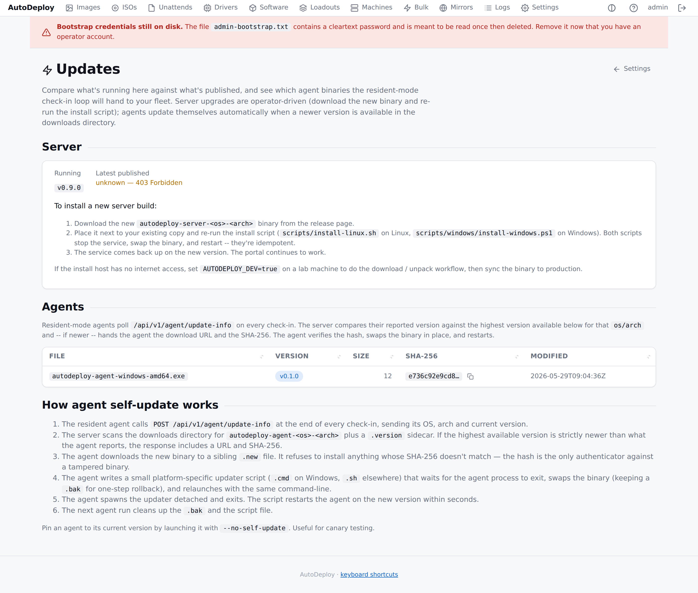

# Operating AutoDeploy in production

> Deployment topology, the env vs portal split, backup/recovery,
> retention, the security review checklist.

## Deployment topology

The initial release is **single-server**. The API and payload
service are stateless apart from SQLite; multi-site sharding is
left for a future design (carried open question from the design
doc).

### Recommended production layout

```
  +-----------+
  |    DCs    |    LDAPS — optional, used only when AD integration is on
  +-----------+

  +-----------+        +---------------------+
  |  Operator |  <---> |   AutoDeploy server |   :443  (HTTPS, portal + API)
  |  browser  |        |  + Domain Service   |   :8080 (loopback HTTP, optional)
  +-----------+        |  + TFTP listener    |   :69   (UDP, iPXE bootstrap only)
                       +---------------------+
                            |  reads / writes
                            v
                     +-------------+
                     |   $DATA_DIR |    /var/lib/autodeploy
                     +-------------+
                          |
                          v
                +-----+  +-----+  +-----+  +-----+
                | iso |  | drv |  | sw  |  | ipxe|   payload blobs + boot kit
                +-----+  +-----+  +-----+  +-----+

  +-------------+      iPXE chainload    +-----------+
  |   Target    |  --- UDP TFTP :69 ---> |  /ipxe/   |
  |   machines  |  --- HTTPS :443 -----> |  /api  ── AutoDeploy
  +-------------+                        +-----------+
```

The server runs on a machine with:

- Reliable connectivity to every site the targets PXE-boot from.
- Disk capacity for ISO/driver/software payloads (50–500 GB
  depending on catalogue size).
- An LDAPS line of sight to the AD service account's DCs (if AD is
  used).
- Outbound HTTP to `boot.ipxe.org` once (during install) so the
  installer can fetch the iPXE bootstrap binaries — or build them
  yourself from <https://github.com/ipxe/ipxe>.

### Local / lab layout

For a single-host lab the defaults are fine:

| Setting | Value |
|---|---|
| `AUTODEPLOY_DEV` | `true` (default) |
| `AUTODEPLOY_HTTP_ADDR` | `127.0.0.1:8080` (default) |
| `AUTODEPLOY_HTTPS_ADDR` | empty (default — no HTTPS) |
| Browse to | `http://127.0.0.1:8080/portal/` |

HTTPS is optional in a lab. See
[Configuring the server](configuration.md#http-vs-https-the-full-rules)
for the full ruleset.

## Configuration: env vars vs portal

AutoDeploy splits its configuration in two:

**Bootstrap settings** (env vars): values the server needs to know
*before* it can listen. These stay in `/etc/default/autodeploy`
(Linux) or `C:\Program Files\AutoDeploy\autodeploy.env` (Windows).

**Runtime settings** (portal): values the operator changes day to
day. Edit them in **Settings → …** in the portal. They are stored
in the database, AES-256-GCM at rest where appropriate (AD bind
password).

### Bootstrap (env vars)

| Variable | Purpose |
|---|---|
| `AUTODEPLOY_HTTP_ADDR` | Cleartext HTTP bind. Loopback only in prod. |
| `AUTODEPLOY_HTTPS_ADDR` | HTTPS bind. |
| `AUTODEPLOY_TLS_CERT` / `_KEY` | PEM cert + key for HTTPS (required in prod). |
| `AUTODEPLOY_TFTP_ADDR` | UDP TFTP listener for the iPXE bootstrap (e.g. `:69`). Empty disables. |
| `AUTODEPLOY_DATA_DIR` | Persistent state root. |
| `AUTODEPLOY_DEV` | `false` in production. |
| `AUTODEPLOY_SECRETS_KEY` | Hex-encoded 32-byte at-rest encryption key. |

### Runtime (portal — Settings)

| Setting | Portal page | Effect |
|---|---|---|
| Access PIN | [Access PIN](security.md#access-pin-the-boot-gate) | Boot-time gate. Hashed at rest. |
| Branding | [Branding](branding.md) | Portal + boot screen + Windows OEM info. |
| Local accounts | [Security](security.md#portal-accounts) | bcrypt-hashed. |
| Active Directory connection | [Active Directory](active-directory.md) | Encrypted bind password; **Test connection** button; changes apply on next manifest fetch. |
| Log retention (days) | Operational | Applied on next hourly tick of the retention scheduler. |
| Concurrent payload throttle | Operational | Applied on next server restart. |
| Payload mirrors | [Mirrors](scaling.md#payload-mirrors) | Applied on next manifest fetch. |

### One-time env seeds (optional)

These env vars **seed** portal-managed values on first start, and
only when the corresponding portal value is empty:

```
AUTODEPLOY_AD_URL, AUTODEPLOY_AD_BIND_DN, AUTODEPLOY_AD_BIND_PASSWORD,
AUTODEPLOY_AD_SEARCH_BASE, AUTODEPLOY_AD_SKIP_TLS_VERIFY,
AUTODEPLOY_LOG_RETENTION_DAYS, AUTODEPLOY_PAYLOAD_MAX_IN_FLIGHT
```

Once the operator saves anything through the portal, the portal is
the source of truth and env changes are ignored. Use the seeds when
configuration management (Ansible, Puppet, …) provisions a fresh
AutoDeploy host; use the portal for day-to-day operation.

## Backup and recovery

Reference scripts:

| Platform | Script | Output |
|---|---|---|
| Linux / macOS | `scripts/backup.sh` | `<out>/autodeploy-<timestamp>.tar.gz` mode 0600 |
| Windows | `scripts/windows/backup.ps1` | `C:\ProgramData\AutoDeploy\backups\autodeploy-<timestamp>.zip` (ACL: Administrators + SYSTEM) |

```sh
# Linux
AUTODEPLOY_DATA_DIR=/var/lib/autodeploy ./scripts/backup.sh /var/backups/autodeploy
```

```powershell
# Windows
.\scripts\windows\backup.ps1
```

The archive contains a consistent SQLite snapshot, the at-rest
encryption key, the TLS material and the (one-time) bootstrap-admin
file if it still exists.

Payload blobs (`iso/`, `drivers/`, `software/`) are **not** in the
archive — they are large and re-uploadable. Take separate
filesystem snapshots if you need them in the same archive.

**Restore**: stop the server, extract the archive into a fresh
`$AUTODEPLOY_DATA_DIR`, restart. **Without the `secrets-key.bin`**
the escrowed PINs and recovery keys are unreadable, so back this up
out-of-band as well.

## Versions and updates



**Settings → Updates** compares the running server version against
the latest published GitHub release and lists every agent binary
staged for distribution.

### How versions are stamped

Each binary (server, Boot Client, agent) is built with
`-ldflags "-X main.Version=<tag>"`. CI sets `VERSION` from the tag
that triggered the build; local `make build` falls back to `dev`.
The Makefiles accept `VERSION=v0.1.2 make build` for one-off
builds.

The version is exposed at:

- `GET /api/v1/version` (open) — server's running version + Go version + GOOS/GOARCH.
- `POST /api/v1/agent/update-info` — server's view of the latest
  agent available for a given `os/arch`, plus SHA-256 and download URL.

### Auto-tag on merge

`.github/workflows/auto-tag.yml` runs on every push to `main` and
pushes a new semver tag, which triggers `release.yml`. Rules:

| Trigger | Effect |
|---|---|
| Default (no PR labels) | patch bump (`v0.1.2` → `v0.1.3`) |
| Merged PR has label `release:minor` | minor bump (`v0.1.2` → `v0.2.0`) |
| Merged PR has label `release:major` | major bump (`v0.1.2` → `v1.0.0`) |
| Commit message contains `[skip release]` or `[no release]` | no tag, no release |
| No prior `v*` tag exists | first release will be `v0.1.0` |

### Server updates — download and apply

The Updates page shows current vs latest published. To upgrade:

1. **Download** the new `autodeploy-server-<os>-<arch>` binary from
   the GitHub release.
2. **Re-run the install script** with the new binary alongside it:
   - Linux: `sudo ./scripts/install-linux.sh`
   - Windows: `.\scripts\windows\install-windows.ps1`
   Both scripts stop the service, replace the binary, restart. They
   preserve the data dir, env file, and TLS material.
3. The portal continues to work; the service comes back up on the
   new version.

The server does **not** self-install — operators own when the
service goes down. The Updates page is download + notify.

### Agent updates — fully automatic

Resident-mode agents poll `/api/v1/agent/update-info` after every
check-in. Mechanism:

1. Agent sends its `os/arch` and current version.
2. Server scans the downloads directory for `autodeploy-agent-<os>-<arch>`
   binaries plus their `.version` sidecars; picks the highest semver.
3. If the highest available version is strictly newer than what the
   agent reports, the response includes a download URL and SHA-256.
4. Agent downloads to a sibling `.new` file. **Refuses to install** if
   the SHA-256 doesn't match — the hash is the only authenticator
   against a tampered binary.
5. Agent writes a small updater script (`.cmd` on Windows, `.sh`
   elsewhere) that:
   - Waits for the agent process to exit (up to 30 s).
   - Renames the binary to `.bak`, moves `.new` into place.
   - Relaunches the agent with the same command-line.
6. Agent spawns the script detached and exits. Restart completes
   within seconds.
7. The next agent run cleans up the `.bak` and the script file.

To **pin** an agent to its current version (canary testing,
staged rollout), launch it with `--no-self-update`. The agent will
report its version on check-in but never apply an update.

### Staging a new agent version

The release workflow writes three files per binary:

```
autodeploy-agent-windows-amd64.exe
autodeploy-agent-windows-amd64.exe.version    # contains "v0.1.3"
autodeploy-agent-windows-amd64.exe.sha256     # "<hex>  filename"
```

Drop all three into `$DATA_DIR/downloads/`. The portal Downloads
page lists the binary; the Updates page shows it as staged for
distribution; the next resident-mode check-in tells every agent in
the fleet to upgrade.

The install scripts seed this directory automatically when the
release bundle is unpacked alongside the server binary.

## Log retention

Set `AUTODEPLOY_LOG_RETENTION_DAYS=90` (or whatever your policy
requires) OR set it through **Settings → Operational**. The
server's hourly retention loop prunes `log_event` rows older than
the cutoff. The loop logs a `retention.log_prune.ok` event with the
row count it removed.

## Security review checklist

See [Security → Security review checklist](security.md#security-review-checklist).
Run before each release.

## Performance baselines

These are sanity numbers; actual depends on the host and storage.

- **Concurrent Boot Clients fetching the same WIM**: throughput
  should scale linearly until disk read bandwidth is hit. The
  server is thin and CPU-bound only on TLS termination.
- **Concurrent agent reports** after a bulk push: server should
  ingest ≥ 100 reports/sec on commodity hardware with the default
  SQLite WAL mode.
- **Bulk job claim latency**: < 50 ms p99 with 10k queued jobs.

The `/metrics` endpoint exposes Prometheus-compatible counters and
histograms — see [Scaling](scaling.md#metrics) for what's there.

## What is intentionally NOT in this release

(See the design's non-goals and the project context primer.)

- Block-level disk cloning.
- macOS or Linux target imaging.
- Software-authoring tooling (deploy yes, build no).
- Per-image or multi-tenant branding.
- Merging of unattend objects up the chain.
- TFTP in the **payload** path. The bootstrap-only TFTP listener
  for iPXE binaries is a sanctioned exception — see
  [Concepts → Where TFTP fits in](concepts.md#where-tftp-fits-in).
- WMIC or WinPE in the boot environment.
- Storage of frozen historical images for routine re-imaging.
- Graded portal permissions.
