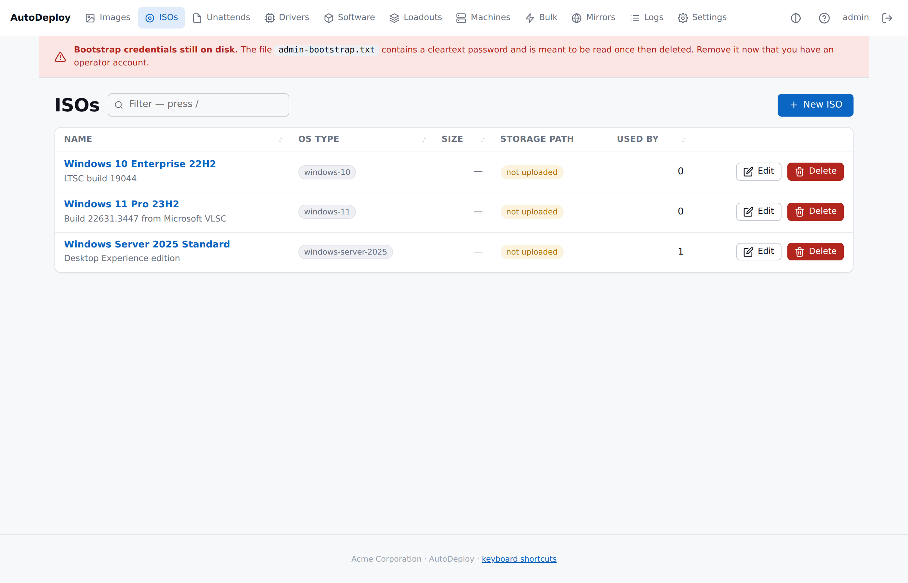
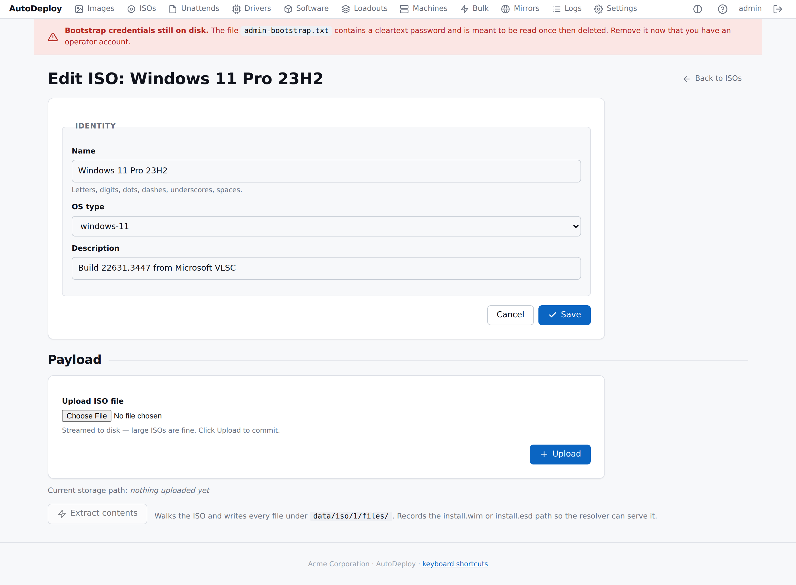

# Payload uploads and delivery

> How ISOs / drivers / software installers get into AutoDeploy and
> back out to a deploying machine.

## ISOs — two-step flow




1. **Upload** the `.iso` file to a previously created ISO row.
2. **Extract** so the resolver can hand the WIM/ESD path to deploys.

### Upload

```sh
curl -X PUT --upload-file ./Win11_24H2.iso \
    http://127.0.0.1:8080/api/v1/isos/1/upload
# {"id":1,"storage_path":"iso/1/source.iso","size_bytes":...}
```

Or click **Upload ISO file** on the ISO edit page; the file is
streamed to disk so large ISOs are fine.

### Extract

```sh
curl -X POST http://127.0.0.1:8080/api/v1/isos/1/extract
# {"id":1,"bytes":4738998272,"wim_path":"sources/install.wim",
#  "storage_path":"iso/1/files/sources/install.wim"}
```

Or click **Extract contents** on the edit page. The server walks
the ISO9660 tree, writes every file under
`data/iso/<id>/files/`, finds `install.wim` (or `install.esd`),
and records its path on the ISO row.

### Download (Boot Client)

Files inside the extracted ISO are individually downloadable:

```sh
curl -O http://127.0.0.1:8080/payload/iso/1/sources/install.wim
```

Downloads honour `Range:` headers, so a Boot Client can resume an
interrupted fetch without restarting from byte zero.

## Driver packages — zip + extract


See [Drivers](driver-matching.md) for the full SCCM ingest flow,
filter setup and the discovered-INF metadata table. In brief:

```sh
# Upload the zip
curl -X PUT --upload-file ./dell-latitude-5520.zip \
    http://127.0.0.1:8080/api/v1/drivers/3/upload

# Extract & scan (parses .inf metadata, writes metadata.json)
curl -X POST http://127.0.0.1:8080/api/v1/drivers/3/extract

# Boot Client fetches the original zip at deploy:
GET /payload/drivers/3
```

## Software installers — opaque blobs

```sh
# Upload
curl -X PUT --upload-file ./acme-suite-2026.msi \
    http://127.0.0.1:8080/api/v1/software/12/upload

# Agent fetches at deploy:
GET /payload/software/12
```

The installer is delivered as-is; the package's [install
steps](software.md#install-steps) decide how to run it. The literal
`{payload}` token in any step path is replaced with the on-disk
path of the downloaded file at run time.

## The deployment manifest

The endpoint a Boot Client calls after the operator picks an image:

```
GET /api/v1/images/{id}/manifest               # without identity
POST /api/v1/images/{id}/manifest               # with SMBIOS identity
```

returns a flat list of payload URLs derived from the resolved
configuration:

```json
{
  "image_id": 4,
  "base_url": "https://autodeploy.lab/",
  "items": [
    {"role":"iso-wim",  "url":".../payload/iso/1/sources/install.wim",
       "name":"Win11","os_type":"windows-11","size_bytes":4738998272},
    {"role":"driver",   "url":".../payload/drivers/3",
       "name":"Dell-Latitude-5520-Drivers","size_bytes":482113760},
    {"role":"software", "url":".../payload/software/12"},
    {"role":"unattend", "url":".../payload/unattend/4?uuid=<smbios>",
       "name":"Win11 Office Standard"}
  ],
  "warnings": []
}
```

The Boot Client is a fact reporter and step executor; it never
computes any of this. If the resolved image is missing an ISO or an
unattend, the manifest still returns and surfaces the problem via
`warnings`.

The **`?uuid=`** parameter on the unattend URL is what triggers
[per-machine identity injection](unattend.md#resolution) when the
Boot Client hands the URL to the server.

## HTTPS

See [Configuring the server](configuration.md#http-vs-https-the-full-rules)
for the full rules. In summary: HTTPS is optional in dev mode.
Production with a non-loopback HTTP bind requires HTTPS to also be
configured.

## HTTP Range and caching

- All `GET /payload/...` responses include `Cache-Control:
  public, max-age=300`. Intermediate caches (Squid, nginx, a
  reverse proxy) MAY serve repeat hits without round-tripping.
- ETags are derived from mtime + size by Go's `http.ServeContent`.
- Range requests resume cleanly.

## Throttle

`AUTODEPLOY_PAYLOAD_MAX_IN_FLIGHT` (default 64) caps concurrent
`/payload/*` requests so a 500-machine PXE burst queues rather than
exhausting file descriptors. Settable via **Settings →
Operational** at runtime (applies on next server restart). 0 =
unlimited; don't pick this on a production node.

## Site routing — payload mirrors

Operators in multi-site setups can offload payload delivery to
per-site HTTP mirrors. See [Scaling → Payload
mirrors](scaling.md#payload-mirrors).
