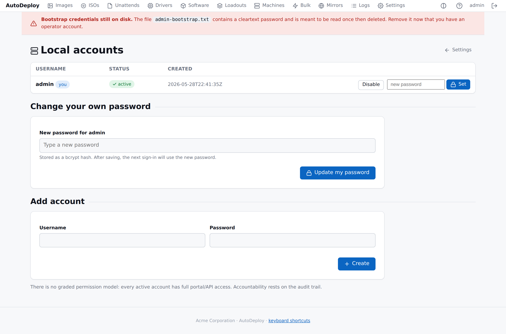
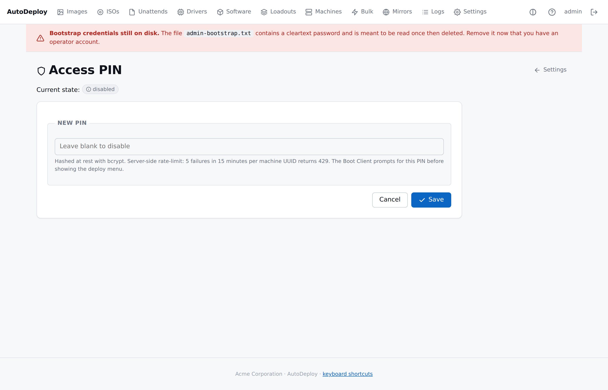

# Security

> Portal accounts, sessions, the access PIN, secret handling, and
> the audit trail.

## Portal accounts



- **bcrypt-hashed passwords**, no graded permissions. Every active
  account has full portal/API access; accountability rests on the
  audit log.
- **Sessions** carry a `HttpOnly`, `SameSite=Lax` cookie, marked
  `Secure` when served over HTTPS. Default TTL is 12 hours.
- **First-time bootstrap**: on a fresh install the server writes
  `$AUTODEPLOY_DATA_DIR/admin-bootstrap.txt` (mode `0600`) containing
  a random password. Operators log in once, change it via
  **Settings → Local accounts → Change your own password**, then
  delete the file. The portal shows a red banner while the file
  still exists.

```sh
# First login from CLI
PW=$(grep ^password ./data/admin-bootstrap.txt | sed 's/^password: //')
curl -c cookie.txt -X POST http://127.0.0.1:8080/api/v1/auth/login \
    -H 'Content-Type: application/json' \
    -d "{\"username\":\"admin\",\"password\":\"$PW\"}"
```

The login response sets a session cookie (`autodeploy_session`).

## Access PIN (the boot gate)



A global PIN gates the Boot Client menu. When configured, every
Boot Client prompts before showing deploy options.

| Property | Detail |
|---|---|
| Storage | bcrypt hash in `system_setting`. |
| Validation | Server-side only. The Boot Client sends each attempt to `POST /api/v1/clients/validate-pin` and respects the verdict. |
| Local limit | Three wrong attempts in a single Boot Client run → fail safe to a normal boot. |
| Server limit | 5 failures in 15 minutes per machine UUID → 429 lockout regardless of reboots. |
| Disable | Save with an empty PIN. The boot menu becomes open. |

## Deploy tokens (agent ↔ server)

The agent's secret-returning endpoint (BitLocker config) requires a
per-machine bearer token:

- Issued by `POST /api/v1/agent/report` when the agent opens a
  deploy with `outcome: "in_progress"`.
- Stored in the agent's memory only — never on disk, never logged.
- Sent as `X-AutoDeploy-Deploy-Token` on subsequent calls.
- Hashed (SHA-256) before storage in `machine_deploy_token`.
- Valid for 24 hours; rotated on every new deploy.

Stealing a SMBIOS UUID is not sufficient to retrieve a BitLocker
PIN — only the freshly-deploying client has the token.

## BitLocker secrets

See [BitLocker](bitlocker.md) for the full story. Summary:

- PINs and recovery keys are AES-256-GCM at rest.
- Encryption key from `AUTODEPLOY_SECRETS_KEY` (preferred) or
  `$DATA_DIR/secrets-key.bin` (auto-generated, mode 0600).
- Back up the key separately from the database.

## Secrets never appear in logs

CONVENTIONS.md §4 enforces this statically.
`scripts/check-secrets.sh` is a CI tripwire that searches the
codebase for patterns that would leak a secret — `slog.String("pin",
...)`, `fmt.Sprintf` with secret-shaped names, and `.Reveal()`
calls outside the audited boundary in `internal/secrets` and
`internal/auth`.

When a secret IS read, the boundary emits a `secret.access` log
line recording **who** retrieved **which secret** — never the value:

```json
{
  "time": "...",
  "level": "WARN",
  "msg": "secret.access",
  "actor": "portal:admin",
  "target": "bitlocker.pin:machine:1",
  "note": "value returned to client; not logged"
}
```

The log ingest endpoint (`POST /api/v1/logs/ingest`) also runs a
"best-effort secret-shape" tripwire — fields like `"pin":"..."`,
`"password":"..."`, `"recovery_key":"..."` are rejected at the
gateway.

## HTTPS rules

See [Configuring the server](configuration.md#http-vs-https-the-full-rules)
for the full ruleset. One line:

- `AUTODEPLOY_DEV=true` (default) → HTTP and HTTPS both work on any
  interface; HTTPS optional.
- `AUTODEPLOY_DEV=false` (production) → HTTP must be loopback OR
  HTTPS must be configured; the server refuses to bind cleartext
  HTTP to a non-loopback address.

## Audit trail

| Event | Source |
|---|---|
| Login / logout | HTTP request log |
| Account create / disable / delete / password reset | HTTP request log |
| Access-PIN enable / disable | HTTP request log |
| Access-PIN attempt (success and failure) | `pin_attempt` table + request log |
| All artifact and image CRUD | HTTP request log |
| Boot Client menu fetch, deploy, agent reports | per-component logs (centralised — see [Logging](logging.md)) |
| Every secret retrieval | `secret.access` log line — who/what, never the value |

## Security review checklist

Run before each release.

- [ ] HTTPS enforced. The server refuses cleartext HTTP on
      non-loopback in production mode.
- [ ] Session cookies are `HttpOnly`, `SameSite=Lax`, `Secure` over
      TLS.
- [ ] Passwords stored as bcrypt hashes. Bootstrap admin password
      written to file (mode 0600), not logged.
- [ ] Access PIN is bcrypt-hashed at rest. Server-side rate limit
      keyed on `system_uuid` (5 / 15min).
- [ ] BitLocker PINs and recovery keys are AES-256-GCM encrypted at
      rest. Recovery-key history is append-only.
- [ ] Agent BitLocker config endpoint requires a valid deploy
      token.
- [ ] AD service-account password loaded from env / portal,
      encrypted at rest, never logged.
- [ ] `scripts/check-secrets.sh` runs in CI and trips on common
      cleartext-secret patterns.
- [ ] `Secret.Reveal()` calls are confined to the audited
      `internal/secrets` and `internal/auth` boundaries.
- [ ] Log ingest endpoint has a body cap (256 KiB), events-per-
      request cap (500), and per-IP rate limit.
- [ ] Boot Client fails safe on every error path — imaging is
      never the default outcome of a failure.
- [ ] Bulk script action requires an authenticated session AND
      every operation row records the operator + target selection.
- [ ] Driver-package filters reject unknown keys at save time so a
      typo cannot silently never-match.
