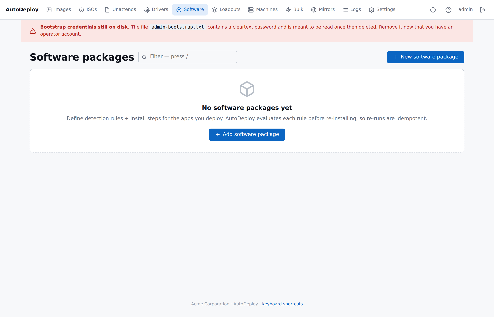

# Software packages

> **Note:** This page documents the single-file payload model. Multi-file
> packages (upload `setup.exe` + `config.xml` + drivers and reference each
> by bare filename in install steps) and env-var expansion in detection
> rules (`%ProgramFiles%\...`) landed later. For those, see:
>
> - **[Tutorial 4 — Add software packages](tutorial-04-add-software.md)** — worked examples (VS Code single-file, Office multi-file).
> - **[Detection rules reference](reference-detection-rules.md)**.
> - **[Install steps reference](reference-install-steps.md)**.
>
> The rest of this page is still accurate for the original single-file model.

> Each package is **detection rules** + **install steps** + an
> installer payload. The agent skips packages that detection reports
> as already installed, so re-runs are idempotent.



## The flow

1. **Software → New software package** → name + description.
2. **Detection rules** — pick a type (file / registry / msi / script)
   and fill in the path / key / GUID / body. Zero rules means
   "install every time" — the agent emits a warning.
3. **Install steps** — ordered list. Pick a type (copy / msi / appx /
   cmd / powershell / exe), set the path, optionally tweak the
   success codes. The literal `{payload}` in any path is replaced
   with the on-disk path of the downloaded installer at run time.
4. **Upload installer payload** — the .msi / .exe / .appx file the
   steps reference.
5. **Link the package** either into a [loadout](loadouts.md) or
   directly to an [image](concepts.md).

At deploy time the agent fetches the effective set, downloads each
package's installer to its work directory, substitutes `{payload}` in
every step path, and executes steps in order honouring
`success_codes` and `continue_on_failure`.

## Detection rules

A package is treated as **already installed** when **every**
detection rule reports present (conservative AND). Zero rules means
**install every time**.

| `type` | Required fields |
|---|---|
| `file` | `file_path`. Optional `file_version`, `file_sha256` for stricter equality. |
| `registry` | `registry_hive`, `registry_key`. Optional `registry_value` + `registry_equals` for value compare. |
| `msi` | `msi_product_code` — the `{GUID}` form Windows uses. |
| `script` | `script_shell` (`cmd` or `powershell`) and `script_body`. Exit code 0 = detected. |

Unknown types are rejected at save time.

## Install steps

Steps run in array order. Each step's `success_codes` (default `[0]`)
and `continue_on_failure` (default `false`) decide the agent's
reaction:

- Exit code is in `success_codes` → step succeeded; move on.
- Exit code is **not** in `success_codes` and `continue_on_failure`
  is `false` → the package is **aborted**; the agent reports failure
  and does not run subsequent steps.
- Exit code is not in `success_codes` and `continue_on_failure` is
  `true` → the agent logs the failure and moves on.

| `type` | Required fields |
|---|---|
| `copy` | `source_path`, `destination_path`. |
| `msi` | `msi_path`. `msi_args` is appended after `/quiet /norestart`. |
| `appx` | `appx_path`. Installed via `Add-AppxPackage`. |
| `cmd` | `script_body`. Runs in `cmd /C`. |
| `powershell` | `script_body`. Runs via `powershell -NoProfile -NonInteractive`, body piped to stdin. |
| `exe` | `exe_path`. `exe_args` is passed verbatim. |

### The `{payload}` token

The literal string `{payload}` in `source_path`, `msi_path`,
`appx_path` or `exe_path` is replaced by the on-disk path of the
package's downloaded installer at run time. You don't have to know
where the agent landed the file:

```json
"steps_json": "[
  {\"type\":\"msi\", \"msi_path\":\"{payload}\", \"success_codes\":[0,3010]}
]"
```

## Worked example — 7-Zip

```json
{
  "name": "7-Zip 24.07",
  "description": "Free archiver",
  "detection_json": "[
    {\"type\":\"registry\",
     \"registry_hive\":\"HKLM\",
     \"registry_key\":\"SOFTWARE\\\\7-Zip\"}
  ]",
  "steps_json": "[
    {\"type\":\"msi\",
     \"msi_path\":\"{payload}\",
     \"success_codes\":[0, 3010]}
  ]"
}
```

`3010` is Windows' "success, reboot required" — common for MSIs. The
agent treats it as success and continues.

## What the agent does

For each package in the effective software set, in order:

1. Evaluate detection rules. If all report present, log
   `package.skip` and move on.
2. Otherwise, download the package's installer payload to the work
   directory (default `C:\ProgramData\AutoDeploy\work`).
3. Substitute `{payload}` in every step path.
4. Execute steps in order, honouring `success_codes` and
   `continue_on_failure`.
5. Log `package.install.ok` or `package.install.fail`.

The agent's per-step log captures the step type, exit code and
whether it aborted — enough to diagnose a failed install through
the portal's [Logs page](logging.md).

## Endpoints (for CI tooling)

```
POST /api/v1/agent/software       # agent → server: returns effective list
GET  /payload/software/{id}       # agent ← server: streams the installer
POST /api/v1/software             # operator → server: create package
PUT  /api/v1/software/{id}        # operator → server: update package
PUT  /api/v1/software/{id}/upload # operator → server: upload installer
```

## Where a package lands

Software packages can be linked from:

- A [loadout](loadouts.md) (most common — share the same set across
  many images).
- An image directly (override the loadout for a specific package).

The resolver returns the union; see [Concepts → Resolution
rules](concepts.md#resolution-rules) for the precedence story.
