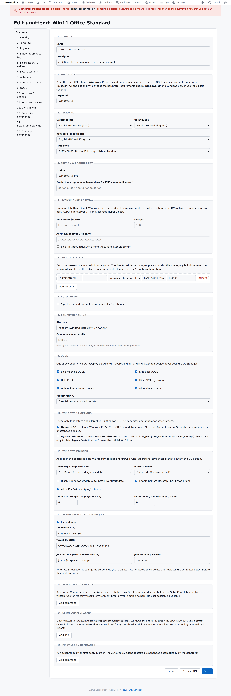

# Unattend configuration

> The operator-facing **structured editor** for the Windows answer
> file. You pick values; AutoDeploy generates the XML.

## At a glance



The unattend editor has 15 sections covering everything Windows setup
asks during OOBE plus the post-deploy knobs operators always end up
scripting by hand. A table of contents on the left jumps between
sections; each section is a fieldset with hint text.

You **never edit the XML directly**. The generated answer file is
produced from your settings at deploy time, with per-machine identity
(computer name, target OU) layered on from the binding when the Boot
Client requests it.

## Sections

1. **Identity** — name and description; not in the XML.
2. **Target OS** — drives generator behaviour. `windows-11` adds
   BypassNRO; `windows-server-2025` enables AVMA fields; etc.
3. **Regional** — locale, UI language, keyboard layout, time zone
   (all with curated dropdowns; you don't have to know the LCIDs).
4. **Edition & product key** — edition picker (filtered by target
   OS) and an optional retail product key.
5. **Licensing (KMS / AVMA)** — KMS host:port for volume activation,
   AVMA key for Server VMs on a licensed Hyper-V host, or
   skip-auto-activation if you'll activate later.
6. **Local accounts** — repeating rows. Each row creates one local
   account (Administrators or Users group) with display name and
   description. The first Administrators-group account also fills
   the built-in Administrator password slot.
7. **Auto-logon** — optional. Signs an account in automatically for
   N boots (useful for post-imaging setup that needs a user session).
8. **Computer naming** — `random` (Windows default `WIN-…`),
   `literal` (use the name in the field), or `prefix` (use the field
   as a prefix plus Windows' random suffix). Bindings override this
   per-machine.
9. **OOBE** — every OOBE-page skip flag the platform supports.
10. **Windows 11 options** — BypassNRO, and the LabConfig hardware-
    requirements bypass.
11. **Windows policies** — telemetry level, Windows Update deferral,
    RDP enable + firewall rule, ICMPv4-in, power scheme.
12. **Domain join** — toggle-revealed block; FQDN, target OU,
    join account credentials. AutoDeploy's Domain Integration
    Service runs delete-and-replace on the AD computer object
    before the unattend runs, so JoinDomain finds the object ready.
13. **Specialize commands** — `RunSynchronousCommand` entries run
    BEFORE OOBE pages render. Use for environment prep.
14. **SetupComplete.cmd** — lines written into
    `%WINDIR%\Setup\Scripts\SetupComplete.cmd`, which Windows runs
    after specialize and before OOBE finishes (no user session
    available; ideal for BitLocker pre-provisioning, reboots, etc.).
15. **First-logon commands** — `SynchronousCommand` entries run
    AFTER the first user logs in. The AutoDeploy agent bootstrap is
    auto-appended.

## Resolution

Unattend follows the design's **nearest-wins, used in full** rule.
The nearest linked unattend up the image's parent chain is used
as-is — no merging. Every unattend is a complete answer file on its
own. "Base" unattends are templates you clone and customise.

**Per-machine identity injection** layers on at deploy. When the
Boot Client downloads `/payload/unattend/<image-id>?uuid=<smbios>`,
the server:

1. Resolves the unattend (nearest-wins).
2. Looks up the requesting machine's binding by UUID.
3. If a binding exists with a `MachineName`, overrides
   `NameStrategy=literal` + `ComputerName=<binding name>`.
4. If a binding has a `TargetOU` AND the unattend has a domain-join
   section, overrides `DomainJoin.OU=<binding OU>`.

That's what makes re-imaging preserve identity and the AD-joined
name match the object the Domain Integration Service prepared.

The portal's preview page shows the catalog XML — without
per-machine overrides — so you can see exactly what your template
produces.

## Secrets

Treat as secrets:

- Every local-account password.
- The auto-logon password.
- The domain-join account password.

These are stored in the unattend row's `settings_json` so the
generator can include them in the XML (Windows needs them). They:

- **Never** appear in any log line.
- Are emitted into the XML at deploy and served only to authenticated
  / bootstrap-token clients.
- Are tripwired by `scripts/check-secrets.sh` in CI so accidental
  `slog.String("password", …)` calls fail the build.

## Settings JSON shape (for the API)

The portal stores its values as JSON in the unattend row. The keys
match the form field names so the generator and the editor stay in
sync. Operators rarely need to look at this; CI tooling and migration
scripts might.

| Key | Default | Notes |
|---|---|---|
| `target_os` | `windows-11` | Drives the generator. |
| `locale` | `en-US` | |
| `ui_language` | same as locale | |
| `keyboard` | `0409:00000409` | Input locale (LCID:KLID). |
| `time_zone` | `GMT Standard Time` | Windows time-zone name. |
| `edition` | `Windows 11 Pro` | |
| `product_key` | omitted | Retail key; KMS targets omit. |
| `kms_server` | omitted | FQDN — sets `slmgr.vbs /skms`. |
| `kms_port` | `1688` | Only emitted with `kms_server`. |
| `avma_key` | omitted | Sets `slmgr.vbs /ipk`. |
| `skip_auto_activation` | `false` | |
| `local_accounts` | `[]` | See below. |
| `auto_logon` | omitted | See below. |
| `name_strategy` | `random` | `random` / `literal` / `prefix`. |
| `computer_name` | empty | Used by literal & prefix. |
| `skip_machine_oobe` | `true` | |
| `skip_user_oobe` | `true` | |
| `hide_eula` | `true` | |
| `hide_oem_registration` | `true` | |
| `hide_online_account_screens` | `true` | |
| `hide_wireless_setup` | `true` | |
| `protect_your_pc` | `3` | |
| `bypass_nro` | `true` | Win11 only. |
| `bypass_win11_reqs` | `false` | Win11 only; LabConfig keys. |
| `telemetry_level` | `0` (off) | `1`/`2`/`3` map to Basic/Enhanced/Full. |
| `disable_windows_update` | `false` | |
| `defer_feature_updates_days` | `0` | |
| `defer_quality_updates_days` | `0` | |
| `enable_rdp` | `false` | Also opens firewall. |
| `allow_icmpv4` | `false` | Adds inbound rule. |
| `power_scheme` | empty | `high` activates High Performance. |
| `domain_join` | omitted | See below. |
| `specialize_commands` | `[]` | RunSynchronousCommand rows. |
| `setup_complete_commands` | `[]` | Lines for `SetupComplete.cmd`. |
| `first_logon_commands` | `[]` | SynchronousCommand rows. |

### Local accounts

```json
"local_accounts": [
  {"name": "Administrator", "password": "...", "group": "Administrators",
   "full_name": "Local Administrator", "description": "Built-in"},
  {"name": "operator", "password": "...", "group": "Users",
   "full_name": "Lab Operator"}
]
```

### Auto-logon

```json
"auto_logon": {"username": "deployadmin", "password": "...", "count": 3}
```

### Domain join

```json
"domain_join": {
  "domain": "corp.acme.example",
  "ou": "OU=Lab,DC=corp,DC=acme,DC=example",
  "join_user": "joiner@corp.acme.example",
  "join_password": "..."
}
```

### Specialize / SetupComplete / First-logon commands

```json
"specialize_commands": [
  {"order": 10, "description": "Lab tweak A",
   "command_line": "reg add HKLM\\Software\\Lab /v A /d 1 /f"}
],
"setup_complete_commands": [
  {"order": 10, "description": "Pre-OOBE: BitLocker pre-provisioning",
   "command_line": "manage-bde -on C: -used"}
],
"first_logon_commands": [
  {"order": 10, "description": "Install corp root CA",
   "command_line": "certutil -addstore Root corp-root.crt"}
]
```

The SetupComplete writer base64-encodes the script and emits a
single PowerShell one-liner in the specialize pass — that handles
arbitrary bytes safely and doesn't need an extra runtime.

## Generating the XML

The endpoint is per-image:

```
GET /payload/unattend/{image-id}            # catalog XML
GET /payload/unattend/{image-id}?uuid=<smbios-uuid>   # with binding overrides
```

The Boot Client uses the `?uuid=` form (the manifest URL already
includes it). The portal's **Preview XML** link uses the bare form
for inspection without binding overrides.

The response is `application/xml`; the Boot Client writes it to
`Windows\Panther\unattend.xml` inside the applied image.
